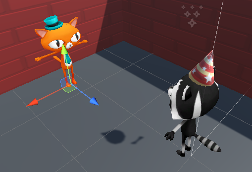
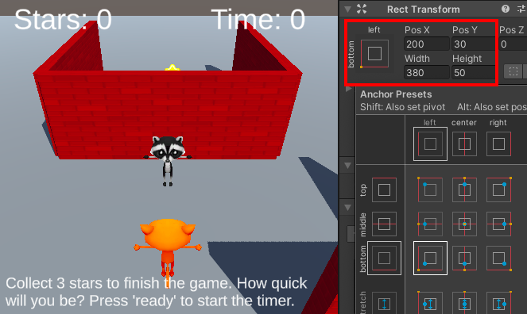
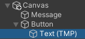

## Gamemaster NPC

The player will talk to a Gamemaster NPC to set the scene and click a button when they are ready to start.

{:width="300px"}

One role an NPC can be programmed to carry out is that of gamemaster. Gamemasters are storytelling NPCs that provide instructions and direct the game. Your gamemaster NPC will give details to introduce the minigame and start the game once the player presses the 'Ready' button.

--- task ---

Launch the Unity Hub and open the project you created for [Star collector](https://projects.raspberrypi.org/en/projects/star-collector/0){:target='_blank'}.

--- collapse ---

---
title: I haven't got my Star collector project
---

If you are not able to open your project you can download, unzip, and import this non-player character assets pack.

[rpf.io/p/en/non-player-characters-go](https://rpf.io/p/en/non-player-characters-go)

--- /collapse ---

--- /task ---

[[[unity-importing-a-package]]]

--- task ---

In the Project window, go to the **Models** folder and drag a `Cat` or `Raccoon` character into the Scene view. 

--- /task ---

--- task ---

With your new character GameObject selected, go to the Inspector window and rename it 'Gamemaster':

--- /task ---

--- task ---

Position your gamemaster NPC using either:

+ The arrows from the Transform and Rotate tools and the Scene view
+ The coordinates from the Transform component in the Inspector window

Your gamemaster NPC character should be close to the Player's starting point and visible at the start of the game.

To make your gamemaster face toward the Player, change the y rotation to `180`:

[[[unity-scene-navigation]]]

--- /task ---

In Unity a **parent GameObject** can have **child GameObjects** that move, rotate, and scale with it. This is really useful for positioning the child objects in relation to their parent. A parent can have many child GameObjects, but a child can have only one parent. 

--- task ---

The gamemaster GameObject has several child GameObjects enabled that represent costumes for the character. 

Choose which costumes to keep enabled and which to disable by unchecking the box in the Inspector window for any you want to remove: 

--- /task ---

--- task ---

Select the gamemaster GameObject and click on **Add Component**. Add a `Box Collider` so that the Player cannot walk through, or climb on top of, the Gamemaster. Change the y 'Center' and 'Size':

--- /task ---

The Gamemaster will use `UI` child GameObjects to display the game instructions and a button to press to start the timer. These child GameObjects will only be displayed when the Player is close enough to talk to the Gamemaster and the game is not already in progress.  

--- task ---

Right-click on the Gamemaster in the Hierarchy window and from UI select `Text - TextMeshPro` to create text that is a child GameObject of the Gamemaster. This will also automatically create a canvas for the text to sit on: 

**Tip:** If you accidentally create the object at the top level, or as a child of the wrong GameObject, you can drag it to the gamemaster GameObject in the Hierarchy window.

--- /task ---

--- task ---

From the Hierarchy window, select the `Text (TMP)` GameObject and rename it to `Message`. In the Text Input component, add a message to explain your minigame. Include the message `Press 'Ready' to start the timer`.  

Put a checkmark in the 'Auto Size' property so that the text resizes to fit the message to the screen of the player:

--- /task ---

--- task ---

Use the 'Rect Transform' component in the Inspector window to anchor the text to the bottom left, then change the Pos x and Pos y coordinates, and the width and height:

--- /task ---

--- collapse ---
---
title: Positioning text with your mouse
---

You can position and size your text box using your mouse. Select your 'Text (TMP)' object in the Hierarchy. Then, while in Scene view, click on **2D** in the toolbar.

Press <kbd>Shift</kbd>+<kbd>F</kbd> to focus on the text, and then zoom out a little to see the position it will sit on the screen.

You can now use the mouse to position and resize the text.

--- /collapse ---

--- task ---

From the Hierarchy window, right-click on the Gamemaster's **Canvas** child GameObject and from **UI** select `Button - TextMeshPro`. This creates a second UI GameObject for the Gamemaster.

Click on the drop-down arrow next to the Button GameObject and select the **Text (TMP)** GameObject. This controls the text message shown on the button. Go to the Inspector window and change the **Text Input** property to `Ready`:

--- /task ---

--- task ---

**Test:** Experiment with the 'Transform' properties of your message and button until you are happy with how they look in the Game view:

Exit Play mode. 

--- /task ---

--- task ---
Select the Gamemaster's **Canvas** and disable it by unchecking the box in the Inspector. 

This means that you will still be able to focus on the 'Gamemaster' in the Scene view using <kbd>F</kbd> (or <kbd>Shift</kbd>+<kbd>F</kbd> from the Hierarchy window). Your code will enable the canvas when it is needed. 

--- /task ---

--- save ---
