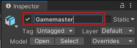
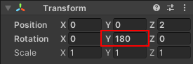
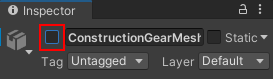
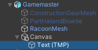

## Gamemaster NPC

<div style="display: flex; flex-wrap: wrap">
<div style="flex-basis: 200px; flex-grow: 1; margin-right: 15px;">
Create an NPC to set the scene and start the game timer.
</div>
<div>
{:width="300px"}
</div>
</div>

One role an NPC can be programmed to carry out is that of gamemaster. Gamemasters are storytelling NPCs that provide instructions and direct the game. Your gamemaster NPC will give details to introduce the minigame and start the game timer once the player presses the 'ready' button.

--- task ---

Launch the Unity hub and open the project you created for [Star collector](https://projects.raspberrypi.org/en/projects/star-collector/0){:target=blank}.

--- collapse ---

---
title: I haven't got my Star collector project
---

If you are not able to open your project you can download, unzip and open this Non-player character starter.

--- /collapse ---

--- /task ---

--- task ---

Right click on the ‘Star collector’ scene in the Hierarchy and ‘Save Scene As’ `Non-player character`.

This creates a new Scene file in the Projects Window. Scenes in a project can share Assets including Scripts.

Your project now contains two scenes but you will only work on one scene at a time.

--- /task ---

--- task ---

In the Project window, go to the 'Models' folder and drag a Cat or Raccoon character into the Scene view. 

--- /task ---

--- task ---

With your new character GameObject selected, go to the Inspector window and rename it 'Gamemaster':



--- /task ---

--- task ---

Position your Gamemaster NPC using either:

+ the arrows from the Transform and Rotate tools and the Scene view
+ the coordinates from the Transform component in the Inspector window

Your Gamemaster NPC character should be close to the Player's starting point and visible at the start of the game.

To make your Gamemaster face toward the Player, change the Y Rotation to `180`:




[[[unity-scene-navigation]]]

--- /task ---

--- task ---

The Gamemaster GameObject has several child GameObjects enabled that represent costumes for the character. 

Choose which costumes to keep enabled and which to disable by unchecking the box in the Inspector window for any you want to remove: 




--- /task ---

--- task ---

Click on 'Add Component' and add a 'Box Collider' so that the Player cannot walk through the Gamemaster.

--- /task ---

<p style="border-left: solid; border-width:10px; border-color: #0faeb0; background-color: aliceblue; padding: 10px;">
<span style="color: #0faeb0">**Parenting**</span> in Unity is when a **parent GameObject** has one or more **child GameObjects** that move, rotate and scale with it. This is really useful for positioning children in relation to their parent. A parent can have many Child GameObjects but a child can have only one parent.
</p>

The Gamemaster will use `UI` **child GameObject** to display the game instructions and have a button to press to start the timer. These child GameObjects will only be displayed when the Player is close enough to talk to the Gamemaster and the game is not already in progress.  

--- task ---

Right-click on the Gamemaster in the Hierarchy window and from `UI` select `Text - TextMeshPro` to create text that is a child GameObject of the Gamemaster. This will also automatically create a canvas for the text to sit on. 



--- /task ---

--- task ---

From the Hierarchy window, select the `Text (TMP)` GameObject. In the 'Text Input' component, add a message to explain your minigame. You should include the message `Press 'ready' to start the timer.` as there will be a button to press to start the minigame. 

Put a checkmark in the 'Auto Size' property so that the text resizes to fit the message to the screen of the player:


--- /task ---

--- task ---

Use the `Rect Transform` component in the Inspector window to anchor the text to the bottom left then change the Pos X & Pos Y coordinates, and the Width and Height:


--- /task ---

--- task ---

From the Hierarchy window, right-click on the Gamemaster's 'Canvas' Child GameObject and from `UI` select `Button - TextMeshPro`. This creates a second UI GameObject for the Gamemaster.

Click on the drop-down arrow next to the 'Button' GameObject and select the 'Text (TMP)' GameObject. This controls the text message shown on the button. Go to the Inspector window and change the Text Input property to `Ready`:


--- /task ---

--- task ---

**Test:** Experiment with the 'Transform' properties of your message and button until you are happy with how they look in the Game view:


--- /task ---

At the moment the canvas is always visible not just enabled when the Player is interacting with the Gamemaster. 

--- task ---

Select your Gamemaster GameObject and click on 'Add Component' in the Inspector window then add a second 'Box Collider'. 

This Box collider will trigger the canvas with message and button to be shown so needs to be bigger than the Box Collider that stops the Player walking into the Gamemaster:


--- /task ---

--- task ---

In the Project window, navigate to the 'My Scripts' folder. Right-click and create a new 'C# Script'. Name the script `NPCText`.

--- /task ---

--- task ---

Double click on the NPCText script to open it in your script editor. Add code to use the TMPro namespace:

```
using UnityEngine;
using TMPro; 
```

--- /task ---

--- task ---

Create a public Canvas variable called `canvas` and add code to disable the canvas at the start:

```
    public Canvas canvas;

    // Start is called before the first frame update
    void Start()
    {
        canvas.enabled = false;
    }
```

--- /task ---

--- task ---

Add two new methods. The first to enable the canvas when the Player is in the collider. The second to diable the canvas when the player has moved away:

```
void Update()
    {
        
    }

    void OnTriggerEnter(Collider other)
    {
        if (other.gameObject.tag == "Player")
        {
            canvas.enabled = true;
        }
    }

    void OnTriggerExit(Collider other)
    {
        if (other.gameObject.tag == "Player")
        {
            canvas.enabled = false;
        }
    }
```

Save your script and return to the Unity editor.

--- /task ---

--- task ---

Select the Gamemaster and drag the 'NPCText' script to the Inspector window. Drag your Canvas child GameObject from the Hierarchy window to the 'Canvas' variable field in the Inspector window Script component.

--- /task ---

--- task ---

**Test:** Play your minigame, walk upto the Gamemaster and move away again. The canvas appears when the Player triggers the Gamemaster collider and disappears with the Player moves away.

--- /task ---

The button looks great but needs to trigger an event when it is pressed.

--- task ---

Open the 'NPCText' script and create two new public variables called 'IsReady' and 'ButtonTime':

```
    public Canvas canvas;
    public bool IsReady = false;
    public float ButtonTime = 0.0f;
```

--- /task ---

--- task ---

Create a public method called `PlayerReady` to set the game conditions when the Player has clicked the 'Ready' button. 

The time the button was pressed needs to be captured so you can work out how long the game has been in play:

```
 public void PlayerReady()
    {
        IsReady = true;
        ButtonTime = Time.time;
        canvas.enabled = false;
    }
```

Save your script and return to the Unity editor.

--- /task ---

--- task ---

From the Hierarchy window, select the Button GameObject then go to the Inspector window 'On Click ()' property and click on the '+'. 

Click on the circle for the field underneath 'Runtime' and choose `Gamemaster`. In the 'Function' dropdown select 'NPCText.PlayerReady' to join your new method to the Button's click event. 


--- /task ---

--- task ---

**Test:** Play your minigame. The button disables the canvas but the time counts up from the second the game begins. 

--- /task ---

--- task ---
Open your StarPlayer script to see the code that controls the time displayed. Create a new public variable for your NPCText script.  
```
    public TMP_Text timerText;
    public NPCText npc;
```

--- /task ---

--- task ---

Amend the code in your `Update` method to only update the time if the button has been pressed and stars are less than three.

Time.time starts when the game begins. Minus the ButtonTime from Time.time to display the elapsed time since the button was pressed.

```
void Update()
    {
        starText.SetText("Stars: " + stars);

        if (npc.IsReady == true && stars < 3)
        {
            timerText.SetText("Time: " + Mathf.Round(Time.time - npc.ButtonTime));
               
        }
    }
```

Save your script and return to the Unity editor.

--- /task ---

--- task ---

Select the 'Player' and go to the 'Star Player (script)' compenent. Click on the circle next to 'Npc' and choose the 'Gamemaster' GameObject. 


--- /task ---

--- task ---

**Test:** Play your minigame. Check that the time doesn't start until the button has been pressed. What happens if you go back to the Gamemaster a second time? 

--- /task ---

--- task ---

Open your NPCText script and amend the condition in OnTriggerEnter to only run if the player collides and the button hasn't been pressed. 

```
void OnTriggerEnter(Collider other)
    {
        if (other.gameObject.tag == "Player" && IsReady == false)
        {
            canvas.enabled = true;
        }
    }
```


--- /task ---

--- save ---