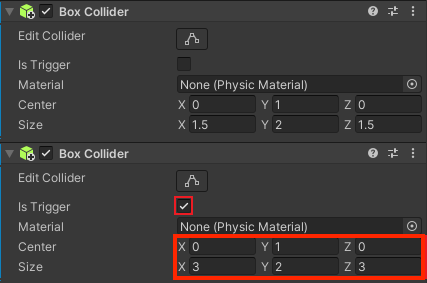
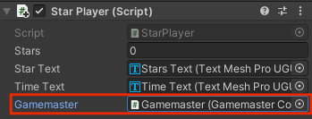
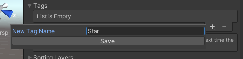

## Controlling the game

It's not fair if the time starts before the player is ready! The button will allow the player to start the time AND activate the stars.

{:width="300px"}

At the moment the canvas is always visible. It should only be enabled when the Player is interacting with the Gamemaster. 

--- task ---

Select your Gamemaster GameObject and click on 'Add Component' in the Inspector window then add a second 'Box Collider'. 

This Box collider will trigger the canvas with the message and the button to be shown, so it needs to be bigger than the Box Collider that stops the Player walking into the Gamemaster:

--- /task ---

--- task ---

With the Gamemaster GameObject selected, add a new Script component and name it `GamemasterController`.

--- /task ---

--- task ---

Double click on the 'GamemasterController' script to open it in your script editor. Add code to use TMPro:

--- code ---
---
language: csharp
filename: GamemasterController.cs
line_numbers: true
line_number_start: 1
line_highlights: 4
---
using System.Collections;
using System.Collections.Generic;
using UnityEngine;
using TMPro;
--- /code ---

--- /task ---

--- task ---

Create a public Canvas variable called `canvas` and add code to make sure the canvas is disabled at the start:

--- code ---
---
language: cs
filename: GamemasterController.cs
line_numbers: true
line_number_start: 6
line_highlights: 8, 12
---
public class GamemasterController : MonoBehaviour
{
    public GameObject canvas;
    // Start is called before the first frame update
    void Start()
    {
        canvas.SetActive(false);
    }
--- /code ---

--- /task ---

--- task ---

Add two new methods. The first to enable the canvas when the Player is in the collider. The second to disable the canvas when the player has moved away:

--- code ---
---
language: cs
filename: GamemasterController.cs
line_numbers: true
line_number_start: 16
line_highlights: 21-35
---
    void Update()
    {
        
    }

    void OnTriggerEnter(Collider other)
    {
        if (other.CompareTag("Player"))
        {
            canvas.SetActive(true);
        }
    }

    void OnTriggerExit(Collider other)
    {
        if (other.CompareTag("Player"))
        {
            canvas.SetActive(false);
        }
    }
--- /code ---

Save your script and return to the Unity editor.

--- /task ---

--- task ---

Drag your 'Gamemaster' **Canvas** child GameObject from the Hierarchy window to the 'Canvas' variable field in the Inspector window Script component.

--- /task ---

--- task ---

**Test:** Play your minigame, walk upto the Gamemaster and move away again. The canvas appears when the Player triggers the Gamemaster collider and disappears with the Player moves away.

Exit playmode. 

--- /task ---

The button looks great but needs to trigger an event when it is pressed.

--- task ---

Open the 'GamemasterController' script and create two new public variables called 'gameStarted' and 'startTime':

--- code ---
---
language: cs
filename: GamesmasterController.cs
line_numbers: true
line_number_start: 6
line_highlights: 9-10
---
public class GamemasterController : MonoBehaviour
{
    public GameObject canvas;
    public bool gameStarted = false;
    public float startTime = 0.0f;
--- /code ---

--- /task ---

--- task ---

Create a public method called `PlayerReady` to set the game conditions when the Player has clicked the 'Ready' button. 

The time the button was pressed needs to be stored so you can work out how long the game has been in play:

--- code ---
---
language: cs
filename: GamemasterController
line_numbers: true
line_number_start: 8
line_highlights: 12-17
---
    public GameObject canvas;
    public bool gameStarted = false;
    public float startTime = 0.0f;

    public void PlayerReady()
    {
        gameStarted = true;
        startTime = Time.time; // time when the button is pressed
        canvas.SetActive(false);
    }
--- /code ---

Save your script and return to the Unity editor.

--- /task ---

--- task ---

From the Hierarchy window, select the 'Button' GameObject then go to the Inspector window 'On Click ()' property and click on the '+'. 

Drag the 'Gamemaster' GameObject from the Hierarchy window to the field underneath 'Runtime Only'. In the 'Function' dropdown select 'GamemasterController.PlayerReady' to join your new method to the Button's click event: 

--- /task ---

--- task ---

**Test:** Play your minigame. The button disables the canvas but the time still counts up from the second the game begins. 

Fix any errors that appear. 

Exit playmode. 

--- /task ---

--- task ---
Open your **StarPlayer** script to see the code that controls the time displayed. 

Create a new public variable for your Gamemaster script:  

--- code ---
---
language: cs
filename: StarPlayer.cs
line_numbers: true
line_number_start: 6
line_highlights: 11
---
public class StarPlayer : MonoBehaviour
{
    public int stars = 0; // an integer whole number
    public TMP_Text starText;
    public TMP_Text timeText;
    public GamemasterController gamemaster;
--- /code ---

--- /task ---

--- task ---

Change the code in your `Update` method to only update the time if the button has been pressed and stars are less than three.

Time.time starts when the game begins. Minus the startTime from Time.time to display the elapsed time since the button was pressed:

--- code ---
---
language: cs
filename: StarPlayer.cs
line_numbers: true
line_number_start: 20
line_highlights: 23, 25
---
    void Update()
    {
        starText.SetText("Stars: " + stars);
        if (stars < 3 && gamemaster.gameStarted == true)
        {
            timeText.SetText("Time: " + Mathf.Round(Time.time - gamemaster.startTime));
        }
    }
--- /code ---

Save your script and return to the Unity editor.

--- /task ---

--- task ---

Select the 'Player' and go to the 'Star Player (script)' component. Click on the circle next to 'Gamemaster' and choose the 'Gamemaster' GameObject: 

--- /task ---

--- task ---

**Test:** Play your minigame. Check that the time doesn't start until the button has been pressed. What happens if you go back to the Gamemaster a second time? 

Exit playmode. 
--- /task ---

--- task ---

Open your 'GamemasterController' script and amend the condition in OnTriggerEnter to only run if the player collides and the button hasn't been pressed: 

--- code ---
---
language: cs
filename: GamemasterController.cs
line_numbers: true
line_number_start: 31
line_highlights: 33
---
    void OnTriggerEnter(Collider other)
    {
        if (other.CompareTag("Player") && gameStarted == false)
        {
            canvas.SetActive(true);
        }
    }
--- /code ---

--- /task ---

--- task ---

**Test:** Play your minigame again. Are there any other ways a Player could cheat? 

At the moment the stars are active when the game begins so the Player could collect the stars before going to the Gamemaster - this would mean a very quick time taken to complete the game!

Exit playmode. 

--- /task ---

You can use Tags to identify objects that you want to treat in the same way. 

--- task ---
Select one of your Star GameObjects and click 'Add Tag' in the Inspector.

Create a new tag called 'Star' by clicking on the '+' icon.

Save your tag and then select all of the Star GameObjects in the Hierarchy by holding down 'Ctrl' (or 'Cmd) and then clicking on each of them. 

Set the tag to 'Star' in the Inspector to set the tag for all of the Stars.

--- /task ---

In C#, you can store multiple objects of the same type in an **Array** variable. An array variable has Left and right square brackets `[]` after the type, so `GameObject[] stars;` stores multiple Star GameObjects. 

--- task ---

Open your 'GamemasterController' script and add a new variable to store your Star GameObjects:

--- code ---
---
language: cs
filename: GamemasterController.cs
line_numbers: true
line_number_start: 6
line_highlights: 11
---
public class GamemasterController : MonoBehaviour
{
    public GameObject canvas;
    public bool gameStarted = false;
    public float startTime = 0.0f;
    GameObject[] stars;
--- /code ---

--- /task ---

You can use a `for` loop to perform the same action on each item in an array. 

--- task ---

Find the Star GameObjects and set them to inactive when the game starts:

--- code ---
---
language: cs
filename: GamemasterController.cs
line_numbers: true
line_number_start: 21
line_highlights: 24-28
---
    void Start()
    {
        canvas.SetActive(false);
        stars = GameObject.FindGameObjectsWithTag("Star");
        foreach (var star in stars)
        {
            star.SetActive(false);
        }
    }
--- /code ---

Set the stars to active once the Player has clicked the ready button:

--- code ---
---
language: cs
filename: GamemasterController.cs
line_numbers: true
line_number_start: 13
line_highlights: 18-21
---
    public void PlayerReady()
    {
        gameStarted = true;
        startTime = Time.time; // time when the button is pressed
        canvas.SetActive(false);
        foreach (var star in stars)
        {
            star.SetActive(true);
        }
    }
--- /code ---

--- /task ---

--- task ---

**Test:** Play your minigame again. Notice that the stars do not appear until the Player has clicked on the 'Ready' button. 

**Debug:** Make sure every star has the 'Star' tag. 

Exit playmode. 

--- /task ---

--- save ---