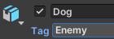

## NPC Patrol

<div style="display: flex; flex-wrap: wrap">
<div style="flex-basis: 200px; flex-grow: 1; margin-right: 15px;">
Patrolling NPCs can be used to slow players down. Changing their path, size, position, and speed can alter the game difficulty. 
</div>
<div>
{:width="300px"}
</div>
</div>

--- task ---

Open the 'Models' folder in the Project window and add a 'Dog' to your scene. 

Use the transform and rotation tools or the 'Transform' component to position the dog in a good position for patrolling and getting in the way of the Player reaching a star. 

**Tip:** To see your map in a top-down view Right click where it says ‘Persp’ in the top right of the Scene view and choose ‘Top’. To return to the normal view, right-click on Top and choose ‘Free’.


--- /task ---

--- task ---

With the Dog selected go to the Inspector window and 'Add Component'. Choose the 'Character Controller'. Position and size the controller so it covers the whole of your Dog.

**Tip:** Select the Dog GameObject in the Hierarchy window and press 'shift' + 'f' to focus on the Dog in the Scene view. 


--- /task ---

--- task ---

Go to the 'Tag' property for the Dog and 'Add Tag'. Click on the '+' and call the new tag 'Enemy'. GameObjects with an 'Enemy' tag will be characters that get in the way and slow the Player down.

Click on the Dog again in the Hierarchy window and use the Tag dropdown box to select 'Enemy' from the list.



--- /task ---

--- task ---

Open the 'My scripts' folder in the Project window and right-click to create a new 'C# Script'. Name the script `PatrolController`.

--- /task ---

--- task ---

Open the 'PatrolController' script and create a patrolSpeed variable. Create another two public variables for the minPosition and maxPosition of the patrol space.

```
    public float patrolSpeed = 3.0F;
    public float minPosition = -4.0F;
    public float maxPosition = 4.0F;
```

--- /task ---

--- task ---

Add code to the `Update` method so the Dog moves foward until the maxPosition is reached then turns `180` degrees and move forward again until the minimum positon is reached. 

```
void Update()
    {
        CharacterController controller = GetComponent<CharacterController>();
        Vector3 forward = transform.TransformDirection(Vector3.forward);
        controller.SimpleMove(forward * patrolSpeed);

        if (transform.position.x < maxPosition)
        {
            transform.Rotate(0, 180, 0);
        }

        if (transform.position.x > minPosition)
        {
            transform.Rotate(0, 180, 0);
        }
```

Save your script and return to the Unity editor.

--- /task ---

--- task ---

Drag the 'PatrolController' script to the Inspector window for the Dog.

--- /task ---

--- task ---

**Test:** Play your game and check that the Dog makes it harder to reach a star quickly. 

Track the movement of the Dog, if the patrol length is not right for your scene you can adjust the 'Min Position' and 'Max Position' in the Inspector whilst the game is playing. 

**Tip:** Remember that variables edited in Playmode are not saved after exiting Playmode so make a note of the positions you like best then exit playmode and go back to your script to update the values in your minPosition and maxPosition variables. Save your script then return to the Unity editor. 


--- /task ---

Now that the position and path of the patrolling dog is decided it's time to make things more realistic with animation.

--- task ---

In the Project window, navigate to the 'Animation' folder. Right-click and got to 'Create' then select 'Animation Controller' name your new animation controller 'PatrolRun'.


--- /task ---

--- task ---

Double click on the 'PatrolRun' animation controller to open it in the Animator window. 

The patrol dog will have just one animation that will run repeatedly. From the animation folder in the Project window, drag the 'Dog_Run' animation up to the Animator window. 


**Tip:** If you can't see all of the boxes in the Animator window you can click on the black grid then press the 'a' key to refocus the window. Then pan left and right using 'alt' + left mouse button or zoom in and out using the 'atl' key + right mouse button. 

--- /task ---

--- task ---

From the Hierarchy window, select the Dog GameObject then go to the Inspector window 'Animator' component. Click on the circle next to 'Controller' and select 'PatrolRun' to link your animation controller.


--- /task ---

--- task ---

**Test:** Play your game to see the patrol dog run up and down across the patrol path.


--- /task ---

--- task ---

**Test:** Tweak your patrol dog until you are happy with the path, and animation. To change the difficulty level you can alter the 'Scale' to make a bigger or smaller dog.


--- /task ---

--- save ---