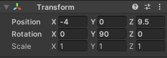
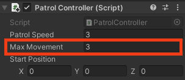

## NPC patrol

Patrolling NPCs can be used to slow players down. Changing their path, size, position, and speed can alter the game difficulty. 

{:width="300px"}

--- task ---

Open the **Models** folder in the Project window and add a **Dog** to your scene. 

Use the Transform and Rotation tools or the Transform component to position the dog in a good position for patrolling — and to obstruct the Player reaching a star! Place the Dog at the **start** of its patrol.

**Tip:** To see your map in a top-down view, right-click where it says **Persp** in the top right of the Scene view and choose **Top**. To return to the normal view, right-click on **Top** and choose **Free**.

--- /task ---

--- task ---

With the Dog selected, go to the Inspector window and **Add Component**. Choose the **Character Controller**. Position and size the controller.

**Tip:** Select the Dog GameObject in the Hierarchy window and press <kbd>Shift</kbd>+<kbd>F</kbd> to focus on the Dog in the Scene view. 

--- /task ---

--- task ---

Click on **Add Component** and add a **Box Collider** to the **Dog** so that the Player cannot walk through, or climb on top of, the Dog. Change the y Center and Size:

--- /task ---

--- task ---

As both the Dog and the Player will be moving, you will need to add a Box Collider to the **Player** so that the Dog cannot climb on top of the Player.

Select the **Player GameObject** from the Hierarchy window, then click **Add Component** and add a **Box Collider**.  Change the y Center and Size:

--- /task ---

--- task ---

With the Dog GameObject selected, add a new Script component and name it `PatrolController`.

--- /task ---

--- task ---

Open the **PatrolController** script and create a public `patrolSpeed` variable. Create another public variable for the maximum distance you want the Dog to move - call it `maxMovement`. You also need a final variable to store the start position, this will be a `Vector3` called `startPosition`.

--- code ---
---
language: cs
filename: PatrolController.cs
line_numbers: true
line_number_start: 5
line_highlights: 7-9
---
public class PatrolController : MonoBehaviour
{
    public float patrolSpeed = 3.0f;
    public float maxMovement = 4.0f;
    public Vector3 startPosition;
--- /code ---

--- /task ---

--- task ---

Add code to the `Start()` and `Update()` methods so the Dog moves forward until the distance from its start position is **greater than** `maxMovement`.

First the `Start()` method is used to set the `startPosition` when the game starts.

`Vector3.Distance()` uses the current position vector and the `startPosition` to calculate the distance the Dog has travelled.

When the max movement is reached the Dog turns `180` degrees and the `startPosition` variable is updated to the current position. The Dog then moves forward again until the maximum distance has been reached, this process repeats to create the patrol behaviour.

--- code ---
---
language: cs
filename: DogController.cs
line_numbers: true
line_number_start: 12
line_highlights: 14, 20, 21, 22, 23, 24, 25, 26, 27, 28, 29, 30
---
    void Start()
    {
        startPosition = transform.position;
    }

    // Update is called once per frame
    void Update()
    {
        CharacterController controller = GetComponent<CharacterController>();
        Vector3 forward = transform.TransformDirection(Vector3.forward);
        controller.SimpleMove(forward * patrolSpeed);
        
        float distance = Vector3.Distance(transform.position, startPosition);

        if (distance > maxMovement)
        {
            transform.Rotate(0, 180, 0);
            startPosition = transform.position;
        }
    }
--- /code ---

Save your script and return to the Unity Editor.

--- /task ---

--- task ---

**Test:** Play your game and check that the Dog makes it harder to reach a star quickly. 

Track the movement of the Dog. If the patrol length is not right for your scene, you can adjust the Max Movement in the Inspector whilst the game is playing. 

**Tip:** Remember that variables edited in Play mode are not saved after exiting Play mode so make a note of the movement length you like best then exit Play mode and set the variable in the Inspector.

--- /task ---

Now that the position and path of the patrolling dog is decided, it's time to make things more realistic with animation.

--- task ---

In the Project window, navigate to the **Animation** folder and then the **Animator** folder. Right-click and go to **Create** then select **Animation Controller** and name your new animation controller `PatrolRun`.

--- /task ---

--- task ---

Double-click on the **PatrolRun** animation controller to open it in the Animator window. 

The patrol dog will have just one animation that will run repeatedly. From the Animation folder in the Project window, drag the **Dog_Run** animation up to the Animator window. 

**Tip:** If you can't see all of the boxes in the Animator window, you can click on the black grid then press the <kbd>a</kbd> key to refocus the window. Then pan left and right using <kbd>Alt</kbd>+left mouse button or zoom in and out using <kbd>Alt</kbd>+right mouse button. 

--- /task ---

--- task ---

From the Hierarchy window, select the **Dog GameObject**, then go to the Inspector window **Animator** component. Click on the circle next to Controller and select **PatrolRun** to link your animation controller.

--- /task ---

--- task ---

**Test:** Play your game to see the patrol dog run across the patrol path.

--- /task ---

--- task ---

**Test:** Tweak your patrol dog until you are happy with the path and animation. To change the difficulty level, you can alter the Scale to make a bigger or smaller dog.

**Debug:** If your animation isn't working, in the Inspector, check that **Apply Root Motion** is not selected for your non-player character.

Exit Play mode. 

--- /task ---

--- save ---
