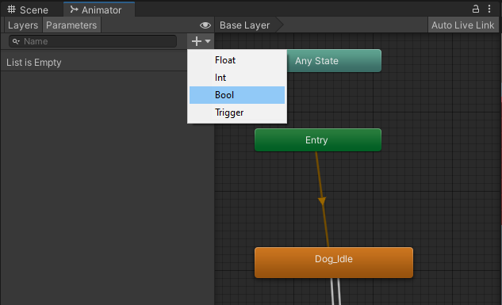
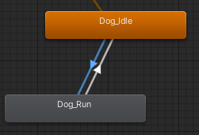
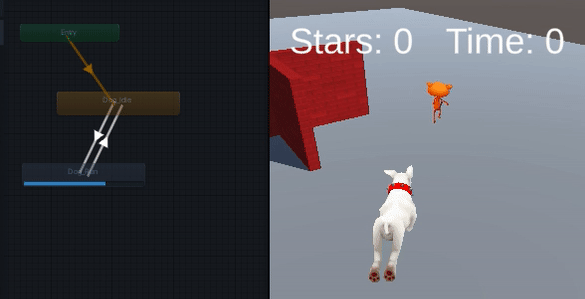

## Follower NPC

<div style="display: flex; flex-wrap: wrap">
<div style="flex-basis: 200px; flex-grow: 1; margin-right: 15px;">
An NPC that follows the Player can be an obstacle - and very annoying! 
</div>
<div>
{:width="300px"}
</div>
</div>

--- task ---

Drag another Dog into the Scene view in a position that would be hard to navigate around. 


--- /task ---

--- task ---

With the Dog selected go to the Inspector window and 'Add Component'. Choose the 'Character Controller'. Position and size the controller so it covers the whole of your Dog.


--- /task ---

--- task ---

Click on 'Add Component' and add a 'Box Collider' to the Dog so that the Player cannot walk through, or climb on top of, the Dog.  Change the Y 'Center' and 'Size':


--- /task ---

--- task ---

Go to the 'Add Component' button again and add a second 'Box Collider' to the Dog. 

This Box collider will use 'IsTrigger' to make the Dog  follow the Player if the Player gets close enough to draw the Dog's attention. This Box collider needs to be big enough that the Player can't easily sneak past:


--- /task ---

--- task ---

With the new Dog GameObject selected, add a new Script component and name it `FollowController`. 

--- /task ---

--- task ---

Double-click on the 'FollowController' script and create a public GameObject variabe. Add code to make the dog continuously look at the Player:

```
    public GameObject Player;

    // Update is called once per frame
    void Update()
    {
        transform.LookAt(Player.transform);
    }
```

Save your script and return to the Unity editor.

--- /task ---

--- task ---

For the 'FollowController' script in the Inspector window. Click on the circle next to 'Player' and select the Player GameObject from the menu:


--- /task ---

--- task ---

**Test:** Play your minigame. Make sure you can't walk through the Dog. Check that the Dog continuously rotates to face the Player.


Exit playmode. 

--- /task ---

--- task ---

Open the 'FollowController' script and create an IsFollowing variable set to `false`. 

```
public bool isFollowing = false;
```

Add a method that triggers when the Player collides with the Dog. This method will set 'IsFollowing' to `true`:

```
    void OnTriggerEnter(Collider other)
    {
        if (other.CompareTag("Player"))
        {
            isFollowing = true;
        }
    }
```

--- /task ---

--- task ---

Create three new variables to set the mechanics of the follow action:

```
    public float followSpeed = 3f;
    public float followDistance = 2f;
    Vector3 moveDirection = Vector3.zero; // no movement
```

--- /task ---

--- task ---

Add code to the `Update` method to move the Dog towards the Player using `SimpleMove`. 

Subtracting the Follower's position vector from the Player's position vector  with `Player.transform.position - transform.position` gives the direction and distance between them. The `Vector3.Normalize` Method turns this into a single unit vector which can be used with `SimpleMove`. 

The Dog should only move if at a distance from the Player so that the Dog doesn't try to move into the same space as the player.

```
    transform.LookAt(Player.transform);

    if (isFollowing == true)
    {
        if (Vector3.Distance(Player.transform.position, transform.position) > followDistance)
        {
            CharacterController controller = GetComponent<CharacterController>();                
            var moveDirection = Vector3.Normalize(Player.transform.position - transform.position);
            controller.SimpleMove(moveDirection * followSpeed);          
        }
    }
```

Save your script and return to the Unity editor.

--- /task ---

--- task ---
**Test:** Play your scene and walk up to the Dog and then walk away. Check that the Dog follows you. 

Exit playmode. 

--- /task ---

Animation Controllers can have more than one animation. The Follower Dog will need animations for when idle and when moving. 

--- task ---

In the Project window, select the 'Animation' folder and right-click then create a new Animation Controller called `FollowerMove`. 

Click on the Dog and go to the Inspector window. Drag the 'FollowerMove' controller to the 'Controller' property in the 'Animator' component:


--- /task ---

--- task ---

Double-click on the 'FollowerMove' controller to open it in the Animation window. Drag the 'Dog_Idle' animation into the grid and place it near the green box marked 'Entry':


--- /task ---

--- task ---

**Test:** Play your minigame and check that the Dog animates when idle. 

Exit playmode. 

--- /task ---

The Dog needs a different animation for when it is moving. 

--- task ---

Drag the 'Dog_Run' animation into the Animator window for the 'FollowerMove' controller. 

Right-click on 'Dog_Idle' and select 'Make Transition' and connect the transition to 'Dog_Run'. Right-click on  'Dog_Run' and select 'Make Transition' and connect the transition to 'Dog_Idle' so you have transitions in both directions. 


--- /task ---

--- task ---

Go to the 'Parameters' tab and click on the dropdown arrow next to the '+'. Choose 'bool' and name your new variable 'isRunning'




--- /task ---

--- task ---

Go to the Animator window and click on the transition arrow from Dog_Idle to Dog_Run: 



In the Inspector window for that transition, go to the Conditions component and click on the '+'. The condition should read 'isRunning' 'true':


Uncheck the 'Has Exit Time' box so that the animation transitions straight away:


--- /task ---

--- task ---

Select the transition arrow from Dog_Run to Dog_Idle and follow the same steps. Uncheck the 'Has Exit Time' box but this time add the condition 'isRunning' is 'false':


--- /task ---

--- task ---

Open the 'FollowController' script and create an animator variable. Add code to the 'Start' method to set `isRunning` to false:

```
    Animator anim;

    // Start is called before the first frame update
    void Start()
    {
        anim = gameObject.GetComponent<Animator>();
        anim.SetBool("isRunning", false);
    }

```

--- /task ---

--- task ---

Update the `if (isFollowing)` code to control the animation:

```
    if (isFollowing == true)
    {
        if (Vector3.Distance(Player.transform.position, transform.position) > followDistance)
        {
            anim.SetBool("isRunning", true);
            CharacterController controller = GetComponent<CharacterController>();                
            var moveDirection = Vector3.Normalize(Player.transform.position - transform.position);
            controller.SimpleMove(moveDirection * followSpeed);          
        }
        else
        {
            anim.SetBool("isRunning", false);
        }
    }
```

Save your script and return to the Unity editor.

--- /task ---

--- task ---

**Test:** Play your minigame and watch what happens in the animator as you collide with and run from the Dog. 

**Tip:** To see the animation effect better whilst testing in playmode: 
+ click on the Dog in the Hierarchy window and then go to the Follow Controller script in the inspector window. Slow the Dog 'Follow Speed' to `0.1`. 
+ click on the Player in the Hierarchy window and then go to Main Camera child GameObject. In the inspector window change the 'z' position of the camera to `-10`.



Exit playmode. 

--- /task ---

--- save ---