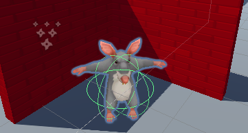
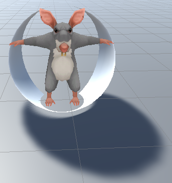
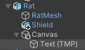

## NPC allies

Allies are characters that help the Player by giving them clues or items; or by giving them abilities such as turbo speed.

{:width="300px"}

So far the minigame has several enemies but no allies. It would be great to have an ally that gives the Player a turbo charge to make the player move and turn faster to complete the game quicker. 

--- task ---

Drag a Rat into the Scene view and into a position that can't be seen by the Player when the game starts:

--- /task ---

--- task ---

With the Rat selected, go to the Inspector window and **Add Component**. Choose the **Character Controller**. Position and size the controller so it covers the centre of the Rat:

--- /task ---

--- task ---

Click on **Add Component** and add a **Box Collider** to the Rat so that the Player cannot walk through, or climb on top of, the Rat. Change the y Center and Size:

--- /task ---

Using animation makes an NPC come to life. 

--- task ---

In the Project window, navigate to the **Animation** folder. Right-click and go to **Create** then select **Animation Controller** and name your new animation controller `AllyIdle`.

Double-click on the **AllyIdle** animation controller to open it in the Animator window. 

From the Animation folder in the Project window, drag the **Cat_IdleHappy** animation up to the Animator window: 

**Tip:** You can use the Cat animations on the Rat and Raccoon because they are designed as humanoids (standing upright, two arms and two legs).  

--- /task ---

--- task ---

From the Hierarchy window, select the **Rat** then go to the Inspector window **Animator** component. Click on the circle next to Controller and select **AllyIdle** to link your Animation Controller:

**Tip:** You can also drag the Animation Controller from the Projects window to the Controller property of the Animator in the Inspector. 

--- /task ---

--- task ---

You can use this same Animator Controller for the Gamemaster to bring them to life!

From the Hierarchy window, select your Gamemaster and drag the **AllyIdle** controller into the Controller field. 

--- /task ---

--- task ---

**Test:** Play your game to see the Rat animate:

Exit Play mode. 

--- /task ---

A character with the Shield model as a child GameObject would look like they have a special effect or power. In your minigame the shield will represent a turbo speed powerup. 

When the Player has the shield, they will move and turn twice as fast — but with the Ally hidden will they manage to find the shield early enough to make a difference?! 

--- task ---

In the Project window, go to the **Models** folder and find the **Shield**. Drag the shield up to the Hierarchy window and position it as a child GameObject of the Player: 

This will automaticaly add the Shield in the same position as the Player:

{:width="300px"}

You will use code to hide the shield until the player picks up the turbo power boost from the Ally NPC.

--- /task ---

--- task ---

Also add a Shield as a child GameObject of the Rat: 

This will automaticaly add the Shield in the same position as the Rat:

{:width="300px"}

--- /task ---

--- task ---

Right-click on the **Rat** in the Hierarchy window and from UI select **Text - TextMeshPro**: 

In the Inspector window for the new Text (TMP) GameObject, add **Text Input** and tick the **Auto Size** box: 

--- /task ---

--- task ---

Use the Rect Transform component in the Inspector window to anchor the text to the bottom left then change the Pos x and Pos y coordinates:

**Tip:** Click on the **Game** tab to see what the text looks like in Game view.  

--- /task ---

The Rat will have the shield visible until the Player collides with it. The shield will then transfer to the Player and the Rat will disappear.

--- task ---

Go to the **Add Component** button again and add a second **Box Collider** to the Rat. 

Check `IsTrigger` and change the size so that it is bigger than the first Box Collider: 

--- /task ---

--- task ---
With the ally Rat GameObject selected, add a new Script component and name it `AllyController`.

Double-click on the **AllyController** script to open it in your script editor. Add code to use the TMPro namespace:

--- code ---
---
language: csharp
filename: AllyController.cs
line_numbers: true
line_number_start: 1
line_highlights: 4
---
using System.Collections;
using System.Collections.Generic;
using UnityEngine;
using TMPro;
--- /code ---

--- /task ---

--- task ---

Create public GameObject and Canvas variables and add code to activate the turbo speed boost on the Ally and not the Player, and disable the canvas at the start:

--- code ---
---
language: csharp
filename: AllyController.cs 
line_numbers: true
line_number_start: 6
line_highlights: 8, 9, 10, 11, 16, 17,18
---
public class AllyController : MonoBehaviour
{
    public GameObject turbo; // Turbo shield on NPC
    public GameObject playerTurbo; // Turbo shield on Player
    public PlayerController player;
    public GameObject canvas;

    // Start is called before the first frame update
    void Start()
    {
        turbo.SetActive(true);
        playerTurbo.SetActive(false);
        canvas.SetActive(false);
    }
--- /code ---

--- /task ---

--- task ---

Add code to enable the canvas and switch the turbo from the Ally to the Player and give the Player the turbo speed-up:

--- code ---
---
language: csharp
filename: AllyController.cs - OnTriggerEnter(Collider other)
line_numbers: true
line_number_start: 6
line_highlights: 13-23
---
public class AllyController : MonoBehaviour
{
    public GameObject turbo; // Turbo shield on NPC
    public GameObject playerTurbo; // Turbo shield on Player
    public PlayerController player;
    public GameObject canvas;

    void OnTriggerEnter(Collider other)
    {
        if (other.CompareTag("Player"))
        {
            turbo.SetActive(false);
            playerTurbo.SetActive(true);
            player.moveSpeed *= 2;
            player.rotateSpeed *= 2;
            canvas.SetActive(true);
        }
    }
--- /code ---

--- /task ---

--- task ---

Add an `OnTriggerExit` method to remove the Rat once the Player moves away to continue the game: 

--- code ---
---
language: csharp
filename: AllyController - OnTriggerExit(Collider other)
line_numbers: true
line_number_start: 25 
line_highlights: 25-31
---
    void OnTriggerExit(Collider other)
    {
        if (other.CompareTag("Player"))
        {
            gameObject.SetActive(false);
        }
    }

    // Start is called before the first frame update
    void Start()
    {
--- /code ---

Save your script and return to the Unity Editor. 

--- /task ---

--- task ---

Click on the **Rat** in the Hierarchy window and find the **AllyController** script in the Inspector window. 

The component should now have four new properties.

**Debug:** The properties won't appear if your script has errors. Check the Console and fix any errors. 

--- /task ---

--- task ---

From the Hierarchy window drag:
+ The Shield child GameObject of the Rat to the Turbo property 
+ The Shield child GameObject of the Player to the Player Turbo property
+ The Player GameObject to the Player property
+ The Canvas child GameObject of the Rat to the Canvas property

--- /task ---

--- task ---

**Test:** Run your minigame and make sure the Player speeds up when the turbo has been applied.

Experiment with the values of Move Speed and Rotate Speed whilst in Play mode until you have the turbo effect you want — remember any changes you make here will not be saved when you exit Play mode, so jot down the values then edit them in the script afterward.

**Tip:** If you can't see the difference in speed from the Game view, you can watch the variables for the Player in the Inspector view. They will change from 3 to 6 when the turbo has transferred to the Player:

**Tip:** If the shield appears on the wrong character then check the `turbo` property has the Rat's Shield and the `playerTurbo` property has the Player's Shield. 

Exit Play mode.
--- /task ---

--- save ---
