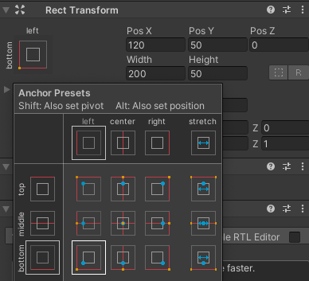
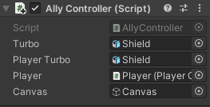
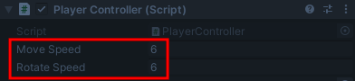

## NPC Allies

<div style="display: flex; flex-wrap: wrap">
<div style="flex-basis: 200px; flex-grow: 1; margin-right: 15px;">
Allies are characters that help the Player by giving them clues, and items; or by increasing or decreasing game variables and objects.
</div>
<div>
{:width="300px"}
</div>
</div>

So far the minigame has several enemies but no allies. It would be great to have an ally that gives the Player a turbo charge to make the player move and turn faster to complete the game quicker. 

--- task ---

Drag a Rat into the Scene view in a position somewhere that is not seen by the Player when the game is started:


--- /task ---

--- task ---

With the Rat selected go to the Inspector window and 'Add Component'. Choose the 'Character Controller'. Position and size the controller so it covers centre of the Rat:


--- /task ---

--- task ---

Click on 'Add Component' and add a 'Box Collider' to the Rat so that the Player cannot walk through, or climb on top of, the Rat. Change the Y 'Center' and 'Size':


--- /task ---

Using animation makes an NPC come to life. 

--- task ---

In the Project window, navigate to the 'Animation' folder. Right-click and got to 'Create' then select 'Animation Controller' name your new animation controller 'AllyIdle'.

Double click on the 'AllyIdle' animation controller to open it in the Animator window. 

From the animation folder in the Project window, drag the 'Char_IdleHappy' animation up to the Animator window: 


--- /task ---

--- task ---

From the Hierarchy window, select the Rat then go to the Inspector window 'Animator' component. Click on the circle next to 'Controller' and select 'AllyIdle' to link your animation controller:


**Tip:** You can also drag the animation controller from the Projects window to the Controller property of the Animator in the Inspector. 

--- /task ---

--- task ---

**Test:** Play your game to see the Rat animate:


--- /task ---

A character with the 'Shield' model as a child gameObject would look like they have a special effect or power. In your minigame the shield will represent a turbo speed powerup. 

When the Player has the shield they will move and turn twice as fast - but with the Ally hidden will they manage to find the shield early enough to make a difference?! 

--- task ---

In the Project window, go to the 'Models' folder and find the 'Shield'. Drag the shield up to the Hierarchy window and position it at a child GameObject of the Rat: 


This will automaticaly add the Shield in the same position as the Rat:


--- /task ---

--- task ---

Right-click on the Rat in the Hierarchy window and from `UI` select `Text - TextMeshPro`: 


In the Inspector window for the new 'Text (TMP)' GameObject add 'Text Input' and tick the 'Auto Size' box: 


--- /task ---

--- task ---

Use the `Rect Transform` component in the Inspector window to anchor the text to the bottom left then change the Pos X & Pos Y coordinates:



--- /task ---

The Rat will have the shield visible until the Player collides. The shield will then transfer to the Player and the Rat will disappear.

--- task ---

Go to the 'Add Component' button again and add a second 'Box Collider' to the Rat. 

Check 'IsTrigger' and change the size so that it is bigger than the Character controller: 


--- /task ---

--- task ---

In the Project window, navigate to the 'My Scripts' folder. Right-click and create a new 'C# Script'. Name the script `AllyController`.

Double click on the NPCText script to open it in your script editor. Add code to use the TMPro namespace:

```
using UnityEngine;
using TMPro; 
```

--- /task ---

--- task ---

Create public GameObject and Canvas variables and add code to activate the turbo on the Ally and not the Player, and disable the canvas at the start:

```
    public GameObject turbo;
    public GameObject PlayerTurbo;
    public Canvas canvas;

    // Start is called before the first frame update
    void Start()
    {
        turbo.SetActive(true);
        PlayerTurbo.SetActive(false);
        canvas.enabled = false;
    }
```

--- /task ---

--- task ---

Add code to enable the canvas and switch the turbo from the Ally to the Player and give the Player the turbo speedup:

```
void OnTriggerEnter(Collider other)
    {
        if (other.gameObject.tag == "Player")
        {
            turbo.SetActive(false);
            PlayerTurbo.SetActive(true);
            PlayerTurbo.moveSpeed = 6.0f;
            PlayerTurbo.rotateSpeed = 6.0f;
            canvas.enabled = true;
        }
    }
```

--- /task ---

--- task ---

Add code to remove the Rat once the Player moves away to continue the game: 

```
void OnTriggerExit(Collider other)
    {
        Destroy(gameObject);
    }
```
Save your script and return to the Unity editor. 

--- /task ---

--- task ---

Click on the Rat and drag the 'AllyController' scrpt from the Project window to the Inspector window. 

From the Hierarchy window drag the Shield child GameObject of the Rat to the 'Turbo' property, the Shield child GameObject of the Player to the 'Player Turbo' property and the 'Canvas' child GameObject to the 'Canvas' property:



--- /task ---

--- task ---

**Test:** Run your minigame and make sure the Player speeds up when the turbo has been applied. 

Experiment with the values of Move Speed and Rotate Speed whilst in Playmode until you have the turbo effect you want - remember any changes you make here will not be saved when you exit playmode so jot down the values then edit them in the script afterward.

**Tip:** If you can't see the difference in speed from the Game view you can watch the variables for the Player in the Inspector view. They will change from 3 to 6 when the turbo has transferred to the Player:




--- /task ---

--- save ---