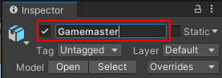
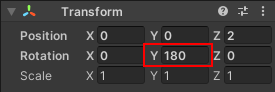
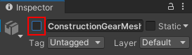
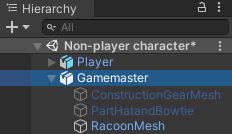
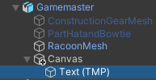
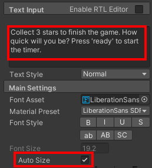
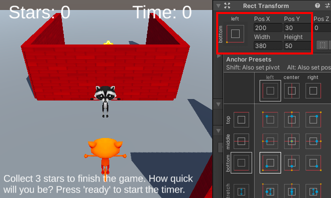
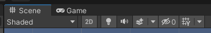
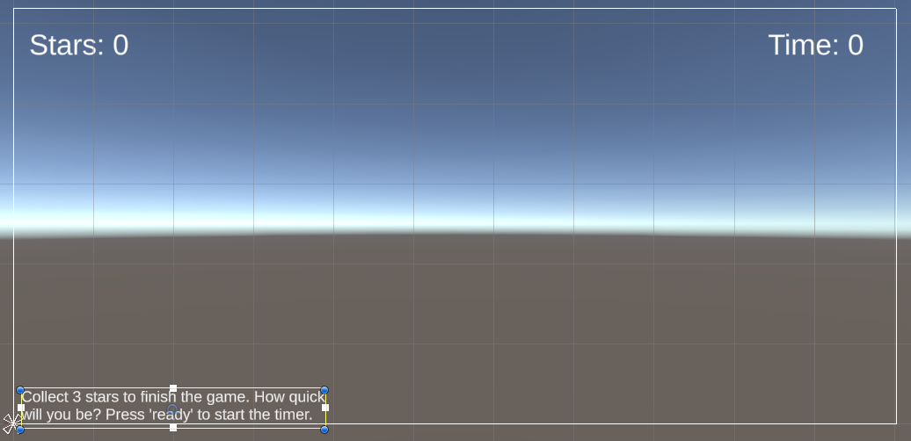

## Gamemaster PNJ

Le joueur parlera à un Gamemaster PNJ pour planter le décor et cliquera sur un bouton lorsqu'il sera prêt à commencer.

{:width="300px"}

Un PNJ peut être programmé pour jouer le rôle de Gamemaster. Les Gamemasters sont des PNJ conteurs qui donnent des instructions et dirigent le jeu. Ton Gamemaster PNJ donnera des détails pour présenter le mini-jeu et démarrer la partie une fois que le joueur aura appuyé sur le bouton « Prêt ».

--- task ---

Lance le Hub Unity et ouvre le projet que tu as créé pour [Collectionneur d'étoiles](https://projects.raspberrypi.org/fr-FR/projects/star-collector/0){:target='_blank'}.

--- collapse ---

---
title: Je n'ai pas mon projet Collectionneur d'étoiles
---

Si tu ne peux pas ouvrir ton projet, tu peux télécharger, décompresser et importer ce pack d'assets de personnages non-joueurs.

[rpf.io/p/fr-FR/non-player-characters-go](https://rpf.io/p/fr-FR/non-player-characters-go)

--- /collapse ---

[[[unity-importing-a-package]]]

--- /task ---

--- task ---

Dans la fenêtre Project, va dans le dossier **Models** et fais glisser un personnage **Cat** ou **Raccoon** dans la vue Scene.

--- /task ---

--- task ---

Avec ton nouveau GameObject personnage sélectionné, va dans la fenêtre Inspector et renomme-le `Gamemaster` :

--- /task ---

--- task ---

Positionne ton Gamemaster PNJ en utilisant :

+ Les flèches des outils Transform et Rotate et de la vue Scene
+ Les coordonnées du composant Transform dans la fenêtre Inspector

Ton Gamemaster PNJ doit être proche du point de départ du joueur et visible au début de la partie.

Pour que ton Gamemaster soit tourné vers le Joueur, change la rotation y sur `180` :

[[[unity-scene-navigation]]]

--- /task ---

Dans Unity, un **GameObject parent** peut avoir des **GameObjects enfants** qui se déplacent, pivotent et changent d'échelle en même temps. C'est très utile pour positionner les objets enfant par rapport à leur parent. Un parent peut avoir plusieurs GameObjects enfants, mais un enfant ne peut avoir qu'un seul parent. 

--- task ---

Le GameObject Gamemaster a plusieurs GameObjects enfants activés qui représentent les costumes du personnage.

Choisis les costumes que tu veux garder activés et ceux que tu veux désactiver en décochant la case dans la fenêtre Inspector pour ceux que tu veux supprimer :

--- /task ---

--- task ---

Sélectionne le **GameObject Gamemaster** et clique sur **Add Component**. Ajoute un **Box Collider** pour que le Joueur ne puisse pas passer à travers, ou monter sur le Gamemaster. Modifie le y Center et Size :

--- /task ---

Le Gamemaster utilisera des GameObjects enfants UI pour afficher les instructions du jeu et un bouton sur lequel appuyer pour démarrer le chronomètre. Ces GameObjects enfants ne s'affichent que lorsque le joueur est suffisamment proche pour parler au Gamemaster et que la partie n'est pas déjà en cours.

--- task ---

Fais un clic droit sur le **Gamemaster** dans la fenêtre Hierarchy et à partir de l'UI, sélectionne **Text - TextMeshPro** pour créer un texte qui est un GameObject enfant du Gamemaster. Cela créera également automatiquement un canvas sur lequel le texte sera placé :

**Astuce :** si tu as accidentellement créé l'objet au niveau supérieur, ou en tant qu'enfant du mauvais GameObject, tu peux le faire glisser vers le GameObject Gamemaster dans la fenêtre Hierarchy.

--- /task ---

--- task ---

Dans la fenêtre Hierarchy, sélectionne le **GameObject Text (TMP)** et renomme-le `Message`. Dans le composant Text Input, ajoute un message pour expliquer ton mini-jeu. Inclus le message `Appuyer sur « Prêt » pour démarrer le chronomètre`.

Coche la propriété Auto Size pour que le texte se redimensionne afin d'adapter le message à l'écran du joueur :

--- /task ---

--- task ---

Utilise le composant Rect Transform dans la fenêtre Inspector pour ancrer le texte en bas à gauche, puis modifie les coordonnées Pos x et Pos y, ainsi que la largeur et la hauteur :

--- /task ---

--- collapse ---
---
title: Positionner le texte à l'aide de la souris
---

Tu peux positionner et agrandir la zone de texte à l'aide de la souris. Sélectionne ton objet **Text (TMP)** dans la fenêtre Hierarchy. Ensuite, lorsque tu es dans la vue Scene, clique sur **2D** dans la barre d'outils.

Appuie sur <kbd>Shift</kbd>+<kbd>F</kbd> pour centrer la vue sur le texte, puis dézoome un peu pour voir où le texte apparaîtra à l'écran.

Tu peux maintenant utiliser la souris pour positionner et redimensionner le texte.

--- /collapse ---

--- task ---

Dans la fenêtre Hierarchy, fais un clic droit sur le **Canvas** du Gamemaster, et dans **UI**, sélectionne **Button - TextMeshPro**. Cela crée un deuxième GameObject UI pour le Gamemaster.

Clique sur la flèche déroulante à côté du bouton GameObject et sélectionne le GameObject **Text (TMP)**. Cela permet de contrôler le message textuel affiché sur le bouton. Va dans la fenêtre Inspector et change la propriété **Text Input** par `Prêt` :

--- /task ---

--- task ---

**Test :** expérimente les propriétés Transform de ton message et de ton bouton jusqu'à ce que tu sois satisfait de leur aspect dans la vue Game :

Si tu es entré en mode Play pour tester, assure-toi de quitter avant de changer la position des messages et des boutons.

--- /task ---

--- task ---
Sélectionne le **Canvas** du Gamemaster et désactive-le en décochant la case dans Inspector.

Cela signifie que tu pourras toujours centrer la vue sur le Gamemaster dans la vue Scene en utilisant <kbd>F</kbd> (ou <kbd>Shift</kbd>+<kbd>F</kbd> à partir de la fenêtre Hierarchy). Ton code activera le canvas lorsqu'il sera nécessaire.

--- /task ---

--- save ---
