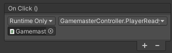
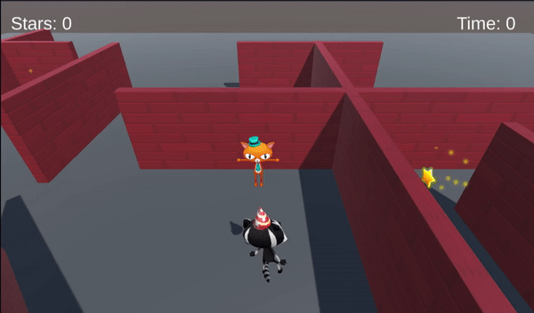

## Contrôler le jeu

Ce n'est pas juste si le temps commence avant que le joueur ne soit prêt ! Le bouton « Prêt » permet au joueur de démarrer le temps ET d'activer les étoiles.

{:width="300px"}

Le bouton a fière allure, mais il doit déclencher un événement lorsqu'on appuie dessus.

--- task ---

Ouvre le script **GamemasterControlleur** et crée deux nouvelles variables publiques appelées `jeu Demarre` et `demarrageTemps` :

--- code ---
---
language: cs filename: GamesmasterController.cs line_numbers: true line_number_start: 6
line_highlights: 9-10
---
public class GamemasterController : MonoBehaviour
{ public GameObject canvas; public bool gameStarted = false; public float startTime = 0.0f; --- /code ---

--- /task ---

--- task ---

Crée une méthode publique appelée `JoueurPret` pour définir les conditions de jeu lorsque le joueur a cliqué sur le bouton « Prêt ».

Le temps auquel le bouton a été pressé doit être enregistrée pour que tu puisses déterminer la durée du jeu :

--- code ---
---
language: cs filename: GamemasterController - PlayerReady() line_numbers: true line_number_start: 8
line_highlights: 12-17
---

    public GameObject canvas;
    public bool gameStarted = false;
    public float startTime = 0.0f;
    
    public void PlayerReady()
    {
        gameStarted = true;
        startTime = Time.time; // Time when the button is pressed
        canvas.SetActive(false);
    }
--- /code ---

Enregistre ton script et reviens à l'éditeur Unity.

--- /task ---

--- task ---

Dans la fenêtre Hierarchy, sélectionne le **GameObject Button** à l'intérieur de **Gamemaster** et de **Canvas**, puis va dans la propriété **On Click ()** de la fenêtre Inspector et clique sur le **+**.

Fais glisser le **GameObject Gamemaster** de la fenêtre Hierarchy vers le champ situé sous « Runtime Only ». Dans le menu déroulant Function, sélectionne **GamemasterControlleur.JoueurPret** pour joindre ta nouvelle méthode à l'événement de clic du bouton :

--- /task ---

--- task ---

**Test :** joue à ton mini-jeu. Le bouton désactive le canvas, mais le temps continue de s'écouler à partir de la seconde où le jeu commence.

Corrige toutes les erreurs qui s'affichent.

Quitte le mode Play.

--- /task ---

--- task --- Ouvre ton script **StarPlayer** pour voir le code qui contrôle le temps affiché.

Crée une nouvelle variable publique pour ton script Gamemaster :

--- code ---
---
language: cs filename: StarPlayer.cs line_numbers: true line_number_start: 6
line_highlights: 11
---
public class StarPlayer : MonoBehaviour
{ public int stars = 0; // An integer whole number public TMP_Text starText; public TMP_Text timeText; public GamemasterController gamemaster; --- /code ---

--- /task ---

--- task ---

Modifie le code de ta méthode `Update` pour ne mettre à jour le temps que si le bouton a été pressé et que les étoiles sont inférieures à trois.

`Time.time` commence lorsque le jeu commence. Soustrais le `demarrageTemps` de `Time.time` pour afficher le temps écoulé depuis que tu as appuyé sur le bouton :

--- code ---
---
language: cs filename: StarPlayer.cs - Update() line_numbers: true line_number_start: 20
line_highlights: 23, 25
---

    void Update()
    {
        starText.SetText("Stars: " + stars);
        if (stars < 3 && gamemaster.gameStarted == true)
        {
            timeText.SetText("Time: " + Mathf.Round(Time.time - gamemaster.startTime));
        }
    }
--- /code ---

Enregistre ton script et reviens à l'éditeur Unity.

--- /task ---

--- task ---

Sélectionne le **Joueur** et va dans le composant **Star Player (script)**. Clique sur le cercle à côté du Gamemaster et choisis le **GameObject Gamemaster** :

Cela ajoutera le script du contrôleur de ton Gamemaster au script de ton joueur `StarPlayer`.

--- /task ---

--- task ---

**Test :** joue à ton mini-jeu. Vérifie que le temps ne démarre pas avant d'avoir appuyé sur le bouton. Que se passe-t-il si tu retournes voir le Gamemaster une deuxième fois ?

Quitte le mode Play.

--- /task ---

--- task ---

Ouvre ton script **GamemasterControlleur** et modifie la condition dans **OnTriggerEnter** pour qu'elle ne s'exécute que si le Joueur entre en collision et que le bouton n'a pas été pressé :

--- code ---
---
language: cs filename: GamemasterController.cs - OnTriggerEnter(Collider other) line_numbers: true line_number_start: 31
line_highlights: 33
---

    void OnTriggerEnter(Collider other)
    {
        if (other.CompareTag("Player") && gameStarted == false)
        {
            canvas.SetActive(true);
        }
    }
--- /code ---

--- /task ---

--- task ---

**Test :** rejoue à ton mini-jeu. Y a-t-il d'autres façons pour un joueur de tricher ?

Pour l'instant, les étoiles sont actives lorsque le jeu commence, le joueur pourrait donc collecter les étoiles avant d'aller voir le Gamemaster. Ce serait trop rapide pour terminer le jeu !

Quitte le mode Play.

--- /task ---

Tu peux utiliser les Tags pour identifier les objets que tu veux traiter de la même manière.

--- task --- Sélectionne l'un de tes **GameObjects Star** et clique sur **Add Tag** dans l'Inspector.

Crée un nouveau tag appelé `Star` en cliquant sur l'icône **+**.

Enregistre ton tag, puis sélectionne tous les **GameObjects Star** dans la fenêtre Hierarchy en maintenant <kbd>Ctrl</kbd> (ou <kbd>Cmd</kbd>) enfoncée, puis en cliquant sur chacun d'eux.

Définis le tag sur « Star » dans l'Inspector ; cela définit le tag pour toutes les étoiles.

--- /task ---

En C#, tu peux stocker plusieurs objets du même type dans une variable **Array**. Une variable array a des crochets gauche et droit `[]` après le type, donc `GameObject[] stars;` stocke plusieurs GameObjects Star.

--- task ---

Ouvre ton script **GamemasterControlleur** et ajoute une nouvelle variable pour stocker tes GameObjects Star :

--- code ---
---
language: cs filename: GamemasterController.cs line_numbers: true line_number_start: 6
line_highlights: 11
---
public class GamemasterController : MonoBehaviour
{ public GameObject canvas; public bool gameStarted = false; public float startTime = 0.0f; GameObject[] stars; --- /code ---

--- /task ---

Tu peux utiliser une boucle `foreach` pour effectuer la même action sur chaque élément d'un array.

--- task ---

Trouve les GameObjects Star et définis-les comme inactifs au début du jeu :

--- code ---
---
language: cs filename: GamemasterController.cs - Start() line_numbers: true line_number_start: 21
line_highlights: 24-28
---

    void Start()
    {
        canvas.SetActive(false);
        stars = GameObject.FindGameObjectsWithTag("Star");
        foreach (var star in stars)
        {
            star.SetActive(false);
        }
    }
--- /code ---

Règle les étoiles pour qu'elles soient actives une fois que le joueur a cliqué sur le bouton Prêt :

--- code ---
---
language: cs filename: GamemasterController.cs - PlayerReady() line_numbers: true line_number_start: 13
line_highlights: 18-21
---

    public void PlayerReady()
    {
        gameStarted = true;
        startTime = Time.time; // Time when the button is pressed
        canvas.SetActive(false);
        foreach (var star in stars)
        {
            star.SetActive(true);
        }
    }
--- /code ---

--- /task ---

--- task ---

**Test :** rejoue à ton mini-jeu. Remarque que les étoiles n'apparaissent pas tant que le joueur n'a pas cliqué sur le bouton Prêt.

**Débogage :** assure-toi que chaque étoile possède le tag « Star ».

Quitte le mode Play.

--- /task ---

--- save ---
