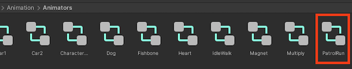
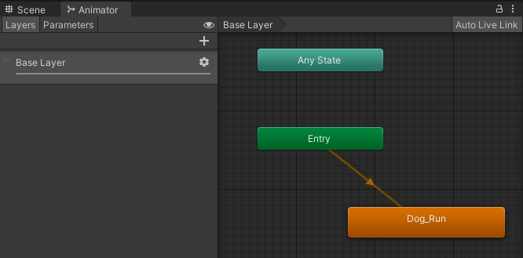
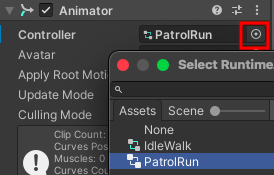

## Patrouilleur PNJ

Les patrouilleurs PNJ peuvent être utilisés pour ralentir les joueurs. En changeant leur trajectoire, leur taille, leur position et leur vitesse, tu peux modifier la difficulté du jeu. 

{:width="300px"}

--- task ---

Ouvre le dossier **Models** dans la fenêtre Project et ajoute **Dog** à ta scène.

Utilise les outils Transform et Rotation ou le composant Transform pour placer le chien dans une bonne position pour patrouiller et pour empêcher le joueur d'atteindre une étoile ! Place le chien au **début** de sa patrouille.

**Astuce :** pour voir ta carte en vue de haut, clique avec le bouton droit de la souris à l'endroit où il est écrit **Persp** en haut à droite de la vue de la scène et choisis **Top**. Pour revenir à la vue normale, fais un clic droit sur **Top** et choisis **Free**.

--- /task ---

--- task ---

Le chien étant sélectionné, va dans la fenêtre Inspector et **Add Component**. Choisis le **Character Controller**. Positionne et dimensionne le controller.

**Astuce :** sélectionne le GameObject Dog dans la fenêtre Hierarchy et appuie sur <kbd>Shift</kbd>+<kbd>F</kbd> pour faire centrer la vue sur le chien dans la vue Scene.

--- /task ---

--- task ---

Clique sur **Add Component** et ajoute un **Box Collider** à **Dog** pour que le joueur ne puisse pas passer à travers le chien, ni grimper dessus. Modifie le y Center et Size :

--- /task ---

--- task ---

Comme le chien et le joueur seront tous deux en mouvement, tu devras ajouter un Box Collider au **Joueur** pour que le chien ne puisse pas grimper sur le joueur.

Sélectionne le **GameObject Joueur** dans la fenêtre Hierarchy, puis clique sur **Add Component** et ajoute un **Box Collider**.  Modifie le y Center et Size :

--- /task ---

--- task ---

Avec le GameObject Dog sélectionné, ajoute un nouveau composant Script et nomme-le `PatrouilleurControleur`.

--- /task ---

--- task ---

Ouvre le script **PatrouilleurControleur** et crée une variable publique `patrouilleurVitesse`. Crée une autre variable publique pour la distance maximale que tu veux que le chien parcoure. Appelle-la `maxMouvement`. Tu as également besoin d'une variable finale pour stocker la position de départ, ce sera un `Vector3` appelé `demarragePosition`.

--- code ---
---
language: cs
filename: PatrolController.cs
line_numbers: true
line_number_start: 5
line_highlights: 7-9
---
public class PatrouilleurControleur : MonoBehaviour
{
    public float patrouilleurVitesse = 3.0f;
    public float maxMouvement = 4.0f;
    public Vector3 demarragePosition;
--- /code ---

--- /task ---

--- task ---

Ajoute du code aux méthodes `Start()` et `Update()` pour que le chien avance jusqu'à ce que la distance par rapport à sa position de départ soit **plus grande que** `maxMouvement`.

Tout d'abord, la méthode `Start()` est utilisée pour définir `demarragePosition` au début du jeu.

`Vector3.Distance()` utilise le vecteur de la position actuelle et `demarragePosition` pour calculer la distance parcourue par le chien.

Lorsque le mouvement maximum est atteint, le chien tourne de `180` degrés et la variable `demarragePosition` est mise à jour en fonction de la position actuelle. Le chien avance ensuite à nouveau jusqu'à ce que la distance maximale soit atteinte, ce processus se répète pour créer le comportement de patrouille.

--- code ---
---
language: cs
filename: DogController.cs
line_numbers: true
line_number_start: 12
line_highlights: 14, 20, 21, 22, 23, 24, 25, 26, 27, 28, 29, 30
---

    void Start()
    {
        demarragePosition = transform.position;
    }
    
    // Update est appelée une fois par image
    void Update()
    {
        CharacterController controller = GetComponent<CharacterController>();
        Vector3 forward = transform.TransformDirection(Vector3.forward);
        controller.SimpleMove(forward * patrouilleurVitesse);
    
        float distance = Vector3.Distance(transform.position, demarragePosition);
    
        if (distance > maxMouvement)
        {
            transform.Rotate(0, 180, 0);
            demarragePosition = transform.position;
        }
    }
--- /code ---

Enregistre ton script et reviens à l'éditeur Unity.

--- /task ---

--- task ---

**Test :** joue à ton jeu et vérifie si le chien rend plus difficile l'atteinte rapide d'une étoile.

Suis le mouvement du chien. Si la longueur de la patrouille ne convient pas à ta scène, tu peux ajuster le mouvement maximal dans l'Inspector pendant que la partie est en cours.

**Astuce :** n'oublie pas que les variables modifiées en mode Play ne sont pas enregistrées après avoir quitté le mode Play. Note donc la longueur de mouvement que tu préfères, puis quitte le mode Play et définis la variable dans l'Inspector.

--- /task ---

Maintenant que la position et la trajectoire du chien patrouilleur sont décidées, il est temps de rendre les choses plus réalistes grâce à l'animation.

--- task ---

Dans la fenêtre Project, va dans le dossier **Animation**, puis dans le dossier **Animator**. Fais un clic droit et va sur **Create** puis sélectionne **Animation Controller** et nomme-le `PatrouilleurCourt`.

--- /task ---

--- task ---

Double-clique sur l'animation controller **PatrouilleurCourt** pour l'ouvrir dans la fenêtre Animator.

Le chien patrouilleur n'aura qu'une seule animation qui s'exécutera de façon répétée. À partir du dossier Animation dans la fenêtre Project, fais glisser l'animation **Dog_Run** vers le haut de la fenêtre Animator.

**Astuce :** si tu ne vois pas toutes les cases de la fenêtre Animator, tu peux cliquer sur la grille noire puis appuyer sur la touche <kbd>a</kbd> pour recentrer la fenêtre. Ensuite, déplace-toi à gauche et à droite avec <kbd>Alt</kbd>+bouton gauche de la souris ou zoome et dézoome avec <kbd>Alt</kbd>+bouton droit de la souris.

--- /task ---

--- task ---

Dans la fenêtre Hierarchy, sélectionne le **GameObject Dog**, puis accède au composant **Animator** de la fenêtre Inspector. Clique sur le cercle à côté de Controller et sélectionne **PatrouilleurCourt** pour lier ton animation controller.

--- /task ---

--- task ---

**Test :** joue à ton jeu pour voir le chien patrouilleur courir sur le chemin de ronde.

--- /task ---

--- task ---

**Test :** ajuste ton chien patrouilleur jusqu'à ce que tu sois satisfait de la trajectoire et de l'animation. Pour changer le niveau de difficulté, tu peux modifier l'échelle pour faire un chien plus grand ou plus petit.

**Débogage :** si ton animation ne fonctionne pas, dans Inspector, vérifie que **Apply Root Motion** n'est pas sélectionné pour ton personnage non-joueur.

Quitte le mode Play.

--- /task ---

--- save ---
