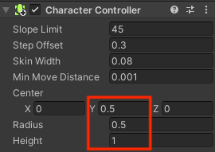

## Suiveur PNJ

Un PNJ qui suit le joueur peut être un obstacle et très ennuyeux ! 

{:width="300px"}

--- task ---

Fais glisser un autre chien vers la vue Scene et vers une position où il est difficile de se déplacer autour.

--- /task ---

--- task ---

Le chien étant sélectionné, va dans la fenêtre Inspector et **Add Component**. Choisis le **Character Controller**. Détermine l'emplacement et la taille du contrôleur pour qu'il couvre l'ensemble de ton chien.

--- /task ---

--- task ---

Clique sur **Add Component** et ajoute un **Box Collider** au chien pour que le joueur ne puisse pas passer à travers, ou grimper sur le chien. Modifie le y Center et Size :

--- /task ---

--- task ---

Va de nouveau sur le bouton **Add Component** et ajoute un deuxième **Box Collider** au chien.

Ce Box Collider utilisera `IsTrigger` pour que le chien suive le joueur si ce dernier s'approche suffisamment pour attirer l'attention du chien. Ce Box Collider doit être suffisamment grand pour que le joueur ne puisse pas se faufiler facilement :

--- /task ---

--- task ---

Avec le nouveau GameObject Dog sélectionné, ajoute un nouveau composant Script et nomme-le `SuivreControleur`.

--- /task ---

--- task ---

Double-clique sur le script **SuivreControleur** et crée une variable publique GameObject. Ajoute du code pour que le script puisse accéder aux attributs de Joueur :

--- code ---
---
language: cs filename: FollowController.cs line_numbers: true line_number_start: 5
line_highlights: 7
---
public class FollowController : MonoBehaviour
{ public GameObject layer;

--- /code ---

--- /task ---

--- task ---

Ajoute une ligne dans la méthode Update pour que le chien regarde toujours le joueur :

--- code ---
---
language: cs filename: FollowController.cs - Update() line_numbers: true line_number_start: 16
line_highlights: 18
---

    void Update()
    {
        transform.LookAt(Player.transform);
    }
--- /code ---

Enregistre ton script et reviens à l'éditeur Unity.

--- /task ---

--- task ---

Clique sur ton deuxième chien dans Hierarchy et fais défiler l'Inspector vers le bas pour voir le script **SuivreControleur** dans la fenêtre.

Clique sur le cercle à côté de Joueur et sélectionne le **GameObject Joueur** dans le menu :

--- /task ---

--- task ---

**Test :** joue à ton mini-jeu. Assure-toi que tu ne peux pas passer à travers le chien. Vérifie que le chien tourne continuellement pour faire face au joueur.

Quitte le mode Play.

--- /task ---

--- task ---

Ouvre le script **SuivreControleur** et crée une variable `suit` définie sur `false`.

--- code ---
---
language: csharp filename: FollowController.cs line_numbers: true line_number_start: 5
line_highlights: 8
---
public class FollowController : MonoBehaviour
{ public GameObject Player; public bool isFollowing = false; --- /code ---

Ajoute une méthode qui se déclenche lorsque le joueur entre en collision avec le chien. Cette méthode définira `suit` sur `true` :

--- code ---
---
language: csharp filename: FollowController.cs - OnTriggerEnter(Collider other) line_numbers: true line_number_start: 5
line_highlights: 10-16
---
public class FollowController : MonoBehaviour
{ public GameObject Player; public bool isFollowing = false;

    void OnTriggerEnter(Collider other)
    {
        if (other.CompareTag("Player"))
        {
            isFollowing = true;
        }
    }
--- /code ---

--- /task ---

--- task ---

Crée trois nouvelles variables pour définir les mécanismes de l'action de suivi :

--- code ---
---
language: csharp filename: FollowController.cs line_numbers: true line_number_start: 5
line_highlights: 9-11
---
public class FollowController : MonoBehaviour
{ public GameObject Player; public bool isFollowing = false; public float followSpeed = 3f; public float followDistance = 2f; Vector3 moveDirection = Vector3.zero; // No movement --- /code ---

--- /task ---

--- task ---

Ajoute du code à la méthode `Update` pour déplacer le chien vers le joueur à l'aide de `SimpleMove`.

En soustrayant le vecteur de position du suiveur au vecteur de position du joueur avec `Player.transform.position - transform.position`, on obtient la direction et la distance qui les séparent. La méthode `Vector3.Normalize` transforme ce vecteur en un vecteur d'une seule unité, qui peut être utilisé avec `SimpleMove`.

Le chien ne doit se déplacer qu'à une certaine distance du joueur afin qu'il n'essaie pas de se déplacer dans le même espace que le joueur.

--- code ---
---
language: csharp filename: FollowController.cs - Update() line_numbers: true line_number_start: 27
line_highlights: 30-39
---

    void Update()
    {
        transform.LookAt(Player.transform);
        if (isFollowing == true)
        {
            if (Vector3.Distance(Player.transform.position, transform.position) > followDistance)
            {
                CharacterController controller = GetComponent<CharacterController>();
                var moveDirection = Vector3.Normalize(Player.transform.position - transform.position);
                controller.SimpleMove(moveDirection * followSpeed);
            }
        }
    }
--- /code ---

Enregistre ton script et reviens à l'éditeur Unity.

--- /task ---

--- task --- **Test :** joue ta scène et approche-toi du chien de façon à être suffisamment proche pour déclencher l'événement, puis éloigne-toi. Vérifie que le chien te suit.

Quitte le mode Play.

--- /task ---

Les Animation Controllers peuvent avoir plus d'une animation. Le chien suiveur aura besoin d'animations lorsqu'il est inactif et lorsqu'il se déplace.

--- task ---

Dans la fenêtre Project, sélectionne le dossier **Animators** à l'intérieur d'**Animation**. Fais un clic droit puis crée un nouveau **Animation Controller** appelé `SuiveurDeplacement`.

Clique sur le **Chien** et accède à la fenêtre Inspector. Fais glisser le contrôleur **SuiveurDeplacement** vers la propriété **Controller** du composant Animator :

--- /task ---

--- task ---

Double-clique sur le contrôleur **SuiveurDeplacement** pour l'ouvrir dans la fenêtre Animation. Fais glisser l'animation **Dog_Idle** dans la grille et place-la près de la case verte marquée « Entry » :

--- /task ---

--- task ---

**Test :** joue à ton mini-jeu et vérifie que le chien s'anime lorsqu'il est inactif.

Quitte le mode Play.

--- /task ---

Le chien a besoin d'une animation différente lorsqu'il se déplace.

--- task ---

Fais glisser l'animation **Dog_Run** dans la fenêtre Animator pour le contrôleur **SuiveurDeplacement**.

Fais un clic droit sur **Dog_Idle** et sélectionne **Make Transition** et connecte la transition à **Dog_Run**. Fais un clic droit sur **Dog_Run** et sélectionne **Make Transition** et connecte la transition à **Dog_Idle** pour que tu aies des transitions dans les deux sens.

--- /task ---

--- task ---

Va dans l'onglet **Parameters** et clique sur la flèche déroulante à côté du « + ». Choisis **bool** et nomme ta nouvelle variable `court`.

--- /task ---

--- task ---

Va dans la fenêtre Animator et clique sur la flèche de transition de Dog_Idle à Dog_Run :

Dans la fenêtre Inspector de cette transition, va dans le composant Conditions et clique sur le **+**. La condition doit se lire `court` is `true` :

Décoche la case « Has Exit Time » pour que l'animation fasse une transition immédiate :

--- /task ---

--- task ---

Sélectionne la flèche de transition de Dog_Run à Dog_Idle et suis les mêmes étapes. Décoche la case « Has Exit Time », mais ajoute cette fois la condition `court` is `false` :

--- /task ---

--- task ---

Ouvre le script **SuiveurControleur** et crée une **variable Animator**. Ajoute du code à la méthode `Start` pour définir `court` sur `false` :

--- code ---
---
language: csharp filename: FollowerController.cs - Start() line_numbers: true line_number_start: 21
line_highlights: 21, 25-26
---

    Animator anim;
    // Start is called before the first frame update
    void Start()
    {
        anim = gameObject.GetComponent<Animator>();
        anim.SetBool("isRunning", false);
    }
--- /code ---

--- /task ---

--- task ---

Fais un Update du code `if (suit)` pour contrôler l'animation :

--- code ---
---
language: csharp filename: FollowerController.cs - Update() line_numbers: true line_number_start: 30
line_highlights: 37, 42-45
---

    void Update()
    {
        transform.LookAt(Player.transform);
        if (isFollowing == true)
        {
            if (Vector3.Distance(Player.transform.position, transform.position) > followDistance)
            {
                anim.SetBool("isRunning", true);
                CharacterController controller = GetComponent<CharacterController>();
                var moveDirection = Vector3.Normalize(Player.transform.position - transform.position);
                controller.SimpleMove(moveDirection * followSpeed);
            }
            else
            {
                anim.SetBool("isRunning", false);
            }
        }
    }
--- /code ---

Enregistre ton script et reviens à l'éditeur Unity.

--- /task ---

--- task ---

**Test :** joue à ton mini-jeu et regarde ce qui se passe dans Animator lorsque tu entres en collision avec le chien et que tu le fuis.

**Astuce :** pour mieux voir l'effet d'animation pendant le test en mode Play :
+ Clique sur le chien dans la fenêtre Hierarchy, puis va sur le script SuiveurControlleur dans la fenêtre Inspector. Ralentis la vitesse de suivi du chien à `0.1`.
+ Clique sur le joueur dans la fenêtre Hierarchy, puis sur le GameObject enfant Main Camera. Dans la fenêtre Inspector, modifie la position z de la caméra sur `-10`.

**Astuce :** assure-toi qu'il n'y a pas de points dans ton jeu où le chien suiveur peut complètement piéger le joueur.

Quitte le mode Play.

--- /task ---

--- save ---
