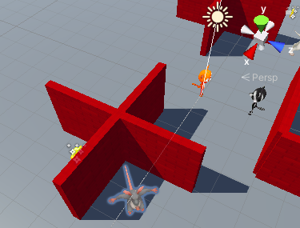
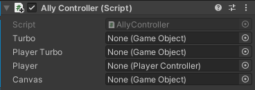

## Alliés PNJ

Les alliés sont des personnages qui aident le joueur en lui donnant des indices ou des objets ; ou en lui donnant des capacités telles que la vitesse turbo.

{:width="300px"}

Pour l'instant, le mini-jeu comporte plusieurs ennemis mais pas d'alliés. Ce serait génial d'avoir un allié qui donne au joueur une charge turbo pour qu'il se déplace et tourne plus vite afin de terminer le jeu plus rapidement.

--- task ---

Fais glisser un Rat dans la vue Scene et à une position que le joueur ne peut pas voir lorsque le jeu commence :

--- /task ---

--- task ---

Le rat étant sélectionné, va dans la fenêtre Inspector et **Add Component**. Choisis le **Character Controller**. Positionne et dimensionne le contrôleur de façon à ce qu'il couvre le centre du Rat :

--- /task ---

--- task ---

Clique sur **Add Component** et ajoute un **Box Collider** au rat pour que le joueur ne puisse pas passer à travers, ou grimper dessus. Modifie le y Center et Size :

--- /task ---

L'utilisation de l'animation permet de donner vie à un PNJ.

--- task ---

Dans la fenêtre Project, va jusqu'au dossier **Animation**. Fais un clic droit et va sur **Create** puis sélectionne **Animation Controller** et nomme ton nouveau animation controller `AllyIdle`.

Double-clique sur l'animation controller **AllyIdle** pour l'ouvrir dans la fenêtre Animator.

À partir du dossier Animation de la fenêtre Project, fais glisser l'animation **Cat_IdleHappy** vers le haut de la fenêtre Animator :

**Astuce :** tu peux utiliser les animations de chat sur le rat et le raton laveur car ils sont conçus comme des humanoïdes (debout, deux bras et deux jambes).

--- /task ---

--- task ---

Dans la fenêtre Hierarchy, sélectionne le **Rat** puis va dans le composant **Animator** dans la fenêtre Inspector. Clique sur le cercle à côté de Controller et sélectionne **AllyIdle** pour lier ton Animation Controller :

**Astuce :** tu peux aussi faire glisser l'Animation Controller de la fenêtre Project vers la propriété Controller de l'Animator dans l'Inspector.

--- /task ---

--- task ---

Tu peux utiliser ce même Animator Controller pour le Gamemaster afin de leur donner vie !

Dans la fenêtre Hierarchy, sélectionne ton Gamemaster et fais glisser le contrôleur **AllyIdle** dans le champ Controller.

--- /task ---

--- task ---

**Test :** joue à ton jeu pour voir le rat s'animer :

Quitte le mode Play.

--- /task ---

Un personnage dont le modèle de bouclier est un GameObject enfant aura l'air d'avoir un effet ou un pouvoir spécial. Dans ton mini-jeu, le bouclier représentera un bonus de vitesse turbo.

Si le joueur a le bouclier, il se déplacera et tournera deux fois plus vite mais si l'allié est caché, parviendra-t-il à trouver le bouclier suffisamment tôt pour faire la différence ?!

--- task ---

Dans la fenêtre Project, va dans le dossier **Models** et trouve **Shield**. Fais glisser le bouclier jusqu'à la fenêtre Hierarchy et positionne-le comme GameObject enfant du joueur :

Cela ajoutera automatiquement le bouclier dans la même position que le joueur :

{:width="300px"}

Tu utiliseras du code pour cacher le bouclier jusqu'à ce que le joueur récupère l'augmentation de puissance turbo auprès du PNJ allié.

--- /task ---

--- task ---

Ajoute également un bouclier en tant que GameObject enfant du rat :

Cela ajoutera automatiquement le bouclier dans la même position que le rat :

{:width="300px"}

--- /task ---

--- task ---

Fais un clic droit sur le **Rat** dans la fenêtre Hierarchy et dans UI, sélectionne **Text - TextMeshPro** :

Dans la fenêtre Inspector du nouveau GameObject Text (TMP), ajoute **Text Input** et coche la case **Auto Size** :

--- /task ---

--- task ---

Utilise le composant Rect Transform dans la fenêtre Inspector pour ancrer le texte en bas à gauche puis modifie les coordonnées Pos x et Pos y :

**Astuce :** clique sur l'onglet **Game** pour voir à quoi ressemble le texte en vue Game.

--- /task ---

Le bouclier du rat sera visible jusqu'à ce que le joueur entre en collision avec lui. Le bouclier sera alors transféré au joueur et le rat disparaîtra.

--- task ---

Va de nouveau sur le bouton **Add Component** et ajoute un deuxième **Box Collider** au Rat.

Coche `IsTrigger` et modifie la taille pour qu'elle soit plus grande que le premier Box Collider :

--- /task ---

--- task ---
Avec le GameObject Rat allié sélectionné, ajoute un nouveau composant Script et nomme-le `AllyController`.

Double-clique sur le script **AllyController** pour l'ouvrir dans ton éditeur de script. Ajoute du code pour utiliser l'espace de noms TMPro :

--- code ---
---
language: csharp
filename: AllyController.cs
line_numbers: true
line_number_start: 1
line_highlights: 4
---
using System.Collections;
using System.Collections.Generic;
using UnityEngine;
using TMPro;
--- /code ---

--- /task ---

--- task ---

Crée des variables publiques GameObject et Canvas et ajoute du code pour activer la vitesse turbo sur l'allié et non sur le joueur, et désactiver le canvas au début :

--- code ---
---
language: csharp
filename: AllyController.cs 
line_numbers: true
line_number_start: 6
line_highlights: 8, 9, 10, 11, 16, 17,18
---
public class AllyController : MonoBehaviour
{
    public GameObject turbo; // Bouclier turbo sur le PNJ
    public GameObject joueurTurbo; // Bouclier turbo sur le joueur
    public PlayerController joueur;
    public GameObject canvas;

    // Start est appelé avant l'update de la première image
    void Start()
    {
        turbo.SetActive(true);
        joueurTurbo.SetActive(false);
        canvas.SetActive(false);
    }
--- /code ---

--- /task ---

--- task ---

Ajoute du code pour activer le canvas et faire passer le turbo de l'allié au joueur et donner au joueur l'accélération du turbo :

--- code ---
---
language: csharp
filename: AllyController.cs - OnTriggerEnter(Collider other)
line_numbers: true
line_number_start: 6
line_highlights: 13-23
---
public class AllyController : MonoBehaviour
{
    public GameObject turbo; // Bouclier turbo sur le PNJ
    public GameObject joueurTurbo; // Bouclier turbo sur le joueur
    public PlayerController joueur;
    public GameObject canvas;

    void OnTriggerEnter(Collider other)
    {
        if (other.CompareTag("Joueur"))
        {
            turbo.SetActive(false);
            joueurTurbo.SetActive(true);
            joueur.vitesseDeplacement *= 2;
            joueur.vitesseRotation *= 2;
            canvas.SetActive(true);
        }
    }
--- /code ---

--- /task ---

--- task ---

Ajoute une méthode `OnTriggerExit` pour supprimer le rat une fois que le joueur s'éloigne pour continuer le partie :

--- code ---
---
language: csharp
filename: AllyController - OnTriggerExit(Collider other)
line_numbers: true
line_number_start: 25 
line_highlights: 25-31
---

    void OnTriggerExit(Collider other)
    {
        if (other.CompareTag("Joueur"))
        {
            gameObject.SetActive(false);
        }
    }
    
    // Start est appelé avant l'update de la première image
    void Start()
    {
--- /code ---

Enregistre ton script et reviens à l'éditeur Unity.

--- /task ---

--- task ---

Clique sur le **Rat** dans la fenêtre Hierarchy et trouve le script **AllyController** dans la fenêtre Inspector.

Le composant devrait maintenant avoir quatre nouvelles propriétés.

**Débogage :** les propriétés n'apparaîtront pas si ton script comporte des erreurs. Vérifie la console et corrige les éventuelles erreurs.

--- /task ---

--- task ---

Dans la fenêtre Hierarchy, fais glisser :
+ Le GameObject Shield enfant du Rat à la propriété Turbo
+ Le GameObject Shield enfant du joueur à la propriété joueur Turbo
+ Le GameObject Joueur à la propriété Joueur
+ Le GameObject Canvas enfant du Rat à la propriété Canvas

--- /task ---

--- task ---

**Test :** exécute ton mini-jeu et vérifie que le joueur accélère lorsque le turbo a été appliqué.

Expérimente les valeurs de Vitesse de déplacement et de Vitesse de rotation en mode Game jusqu'à ce que tu obtiennes l'effet turbo que tu souhaites. N'oublie pas que les changements que tu fais ici ne seront pas enregistrés lorsque tu quitteras le mode Game, alors note les valeurs et modifie-les dans le script par la suite.

**Astuce :** si tu ne peux pas voir la différence de vitesse à partir de la vue Game, tu peux regarder les variables du joueur dans la vue Inspector. Elles passeront de 3 à 6 lorsque le turbo aura été transféré au joueur :

**Astuce :** si le bouclier apparaît sur le mauvais personnage, vérifie alors que la propriété `turbo` possède le bouclier du rat et que la propriété `playerTurbo` possède le bouclier du joueur.

Quitte le mode Play.
--- /task ---

--- save ---
