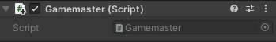

## Gamemaster NPC

De speler communiceert met een Gamemaster NPC om zich voor te bereiden op het spel en klikt op een knop wanneer hij klaar is om te beginnen.

{:width="300px"}

Een rol waarvoor een NPC kan worden geprogrammeerd, is die van gamemaster. Gamemasters zijn verhalende NPC's die instructies geven en de game regisseren. Je gamemaster NPC zal details geven om de minigame te introduceren en het spel te starten zodra de speler op de knop 'klaar' drukt.

--- task ---

Start de Unity Hub en open het project dat je hebt gemaakt voor [Sterren Verzamelaar ](https://projects.raspberrypi.org/en/projects/star-collector/0){:target='_blank'}.

--- collapse ---

---
title: Ik heb nog geen Sterren Verzamelaar project
---

Als je je project niet kunt openen, kun je dit non-players-characters assets pack downloaden, unzippen en importeren.

[rpf.io/p/en/non-player-characters-go](https://rpf.io/p/en/non-player-characters-go)

--- /collapse ---

[[[unity-importing-a-package]]]

--- /task ---

--- task ---

Ga in het venster Project naar de map **Models** en sleep een ** Cat ** of ** Raccoon ** naar de scèneweergave.

--- /task ---

--- task ---

Ga met je GameObject van je nieuwe personage geselecteerd naar het Inspector-venster en hernoem het naar `Gamemaster`:

--- /task ---

--- task ---

Positioneer je gamemaster NPC met behulp van:

+ De pijlen van de Transform and Rotate tools en de Scene view
+ De coördinaten van de Transform component in het Inspector venster

Je gamemaster NPC-personage moet dicht bij het beginpunt van de speler staan en aan het begin van het spel zichtbaar zijn.

Verander de Y rotation in `180`om je Gamemaster naar de Player te laten kijken:

[[[unity-scene-navigation]]]

--- /task ---

In Unity kan een **bovenliggend GameObject** **onderliggende GameObjects** hebben die meebewegen, roteren en schalen. Dit is echt handig voor het positioneren van de onderliggende (child) objecten ten opzichte van hun bovenliggende (parent). Een parent kan veel onderliggende GameObjects hebben, maar een child kan slechts één parent hebben. 

--- task ---

Het Gamemaster-object heeft verschillende onderliggende GameObjects die kostuums voor het personage weergeven.

Kies welke kostuums ingeschakeld moeten blijven en welke moeten worden uitgeschakeld door het selectievakje in het venster Inspector uit te schakelen voor alle kostuums die je wilt verwijderen:

--- /task ---

--- task ---

Selecteer de **Gamemaster GameObject** en klik op **Add Component**. Voeg een **Box Collider** toe zodat de Player niet door de Gamemaster kan lopen of erop kan klimmen. Wijzig het Y-Center (midden) en de Size (grootte):

--- /task ---

De gamemaster gebruikt UI-child GameObjects om de spelinstructies weer te geven en een knop om op te drukken om de timer te starten. Deze onderliggende GameObjects worden alleen weergegeven als de speler dichtbij genoeg is om met de Gamemaster te communiceren en het spel nog niet bezig is.

--- task ---

Klik met de rechtermuisknop op de **Gamemaster** in het Hierarchy venster en selecteer in de UI **Text - TMP (TextMeshPro)** om een tekst te maken als onderliggend GameObject van de Gamemaster. Hiermee wordt ook automatisch een canvas gemaakt waarop de tekst kan worden geplaatst:

**Tip:** Als je per ongeluk het object op het hoogste niveau hebt gemaakt, of als een child van het verkeerde GameObject, kun je het naar het Gamemaster GameObject in het Hierarchy venster slepen.

--- /task ---

--- task ---

Selecteer in het Hierarchy venster het **Text (TMP) GameObject** en hernoem het naar `Message`. Voeg in het onderdeel tekstinvoer een bericht toe om je minigame uit te leggen. Voeg het bericht `Druk op 'Klaar' om de timer te starten` toe.

Zet een vinkje in de eigenschap Auto Size (automatisch formaat) zodat de grootte van de tekst wordt aangepast aan de grootte van het scherm van de speler:

--- /task ---

--- task ---

Gebruik de Rect Transform-component in het Inspector venster om de tekst linksonder te verankeren en wijzig vervolgens de Pos x- en Pos y-coördinaten en de width en height:

--- /task ---

--- collapse ---
---
title: Tekst positioneren met je muis
---

Je kunt het tekstvak positioneren en vergroten met de muis. Selecteer je **Text (TMP)**-object in het Hierarchy venster. Klik vervolgens in de Scene view op **2D** in de werkbalk.

Druk op <kbd>Shift</kbd>+<kbd>F</kbd> om de tekst beter te bekijken en zoom vervolgens een beetje uit om te zien waar de tekst op het scherm komt te staan.

Je kunt nu de muis gebruiken om de tekst te positioneren en het formaat ervan te wijzigen.

--- /collapse ---

--- task ---

Klik in het Hierarchy venster met de rechtermuisknop op het Gamemaster's **Canvas** onderliggende GameObject en selecteer in **UI** **Button - TextMeshPro**. Hiermee wordt een tweede UI GameObject gemaakt voor de Gamemaster.

Klik op de vervolgkeuzepijl naast de Button GameObject en selecteer het **Text (TMP)** GameObject. Dit regelt het tekstbericht dat op de knop wordt weergegeven. Ga naar het Inspector-venster en wijzig de eigenschap **Text Input** in `Klaar`:

--- /task ---

--- task ---

**Test:** Experimenteer met de Transform-eigenschappen van je bericht en knop totdat je tevreden bent met hoe ze eruitzien in de Game-weergave:

Als je de afspeelmodus hebt geopend om te testen, zorg er dan voor dat je die afsluit voordat je de positie van het bericht en de knoppen wijzigt.

--- /task ---

At the moment, the canvas is always visible. It should only be enabled when the Player is interacting with the Gamemaster.

--- task ---

Select your **Gamemaster GameObject** and click on **Add Component** in the Inspector window then add a second **Box Collider**.

This Box Collider will trigger the canvas with the message and the button to be shown, so it needs to be bigger than the Box Collider that stops the Player walking into the Gamemaster:

--- /task ---

--- task ---

With the Gamemaster GameObject selected, add a new Script component and name it `GamemasterController`.

--- /task ---

--- task ---

Double-click on the **GamemasterController** script to open it in your script editor. Add code to use TMPro:

--- code ---
---
language: cs filename: GamemasterController.cs line_numbers: true line_number_start: 1
line_highlights: 4
---
using System.Collections; using System.Collections.Generic; using UnityEngine; using TMPro; --- /code ---

--- /task ---

--- task ---

Create a public canvas variable called `canvas` and add code to make sure the canvas is disabled at the start:

--- code ---
---
language: cs filename: GamemasterController.cs line_numbers: true line_number_start: 6
line_highlights: 8, 12
---
public class GamemasterController : MonoBehaviour
{
    public GameObject canvas;
    // Start is called before the first frame update
    void Start()
    {
        canvas.SetActive(false);
    }
--- /code ---

--- /task ---

--- task ---

Add two new methods. The first to enable the canvas when the Player is in the collider. The second to disable the canvas when the Player has moved away:

--- code ---
---
language: cs filename: GamemasterController.cs line_numbers: true line_number_start: 16
line_highlights: 21-35
---

    void Update()
    {
    
    }
    
    void OnTriggerEnter(Collider other)
    {
        if (other.CompareTag("Player"))
        {
            canvas.SetActive(true);
        }
    }
    
    void OnTriggerExit(Collider other)
    {
        if (other.CompareTag("Player"))
        {
            canvas.SetActive(false);
        }
    }
--- /code ---

Save your script and return to the Unity Editor.

--- /task ---

--- task ---

Find the **Gamemaster Canvas child GameObject** in the Hierarchy window. Drag the Canvas GameObject to the Canvas variable field in the GamemasterController script component in the Inspector.

--- /task ---

--- task ---

**Test:** Play your minigame, walk up to the Gamemaster and move away again. The canvas appears when the Player triggers the Gamemaster collider and disappears when the Player moves away.

Exit Play mode.

--- /task ---

--- save ---
