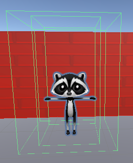
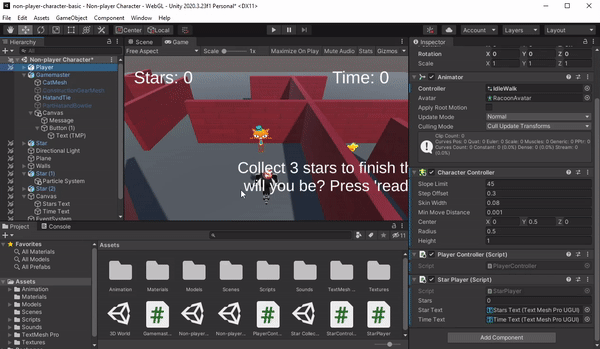
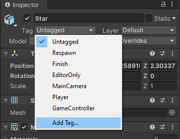

## Het spel besturen

Het is niet eerlijk als de tijd begint voordat de speler klaar is! Met de knop 'Klaar' kan de speler de tijd starten EN de sterren activeren.

{:width="300px"}

Op dit moment is het canvas altijd zichtbaar. Het mag alleen worden ingeschakeld wanneer de speler met de Gamemaster communiceert.

--- task ---

Selecteer je **Gamemaster GameObject** en klik op **Add Component** in het venster Inspector en voeg vervolgens een tweede **Box Collider** toe.

Deze Box Collider zal het canvas activeren met het bericht en de knop die moet worden weergegeven, dus het moet groter zijn dan de Box Collider die de speler tegenhoudt om tegen de Gamemaster op te lopen:

--- /task ---

--- task ---

Voeg, met het Gamemaster GameObject geselecteerd, een nieuwe scriptcomponent toe en noem het `GamemasterController`.

--- /task ---

--- task ---

Dubbelklik op het script **GamemasterController** om het te openen in je script editor. Voeg code toe om TMPro te gebruiken:

--- code ---
---
language: cs
filename: GamemasterController.cs
line_numbers: true
line_number_start: 1
line_highlights: 4
---
using System.Collections;
using System.Collections.Generic;
using UnityEngine;
using TMPro;
--- /code ---

--- /task ---

--- task ---

Maak een openbare canvas variabele met de naam `canvas` en voeg code toe om ervoor te zorgen dat het canvas aan het begin is uitgeschakeld:

--- code ---
---
language: cs
filename: GamemasterController.cs
line_numbers: true
line_number_start: 6
line_highlights: 8, 12
---
public class GamemasterController : MonoBehaviour
{
    public GameObject canvas;
    // Start wordt aangeroepen vóór de eerste frame-update
    void Start()
    {
        canvas.SetActive(false);
    }
--- /code ---

--- /task ---

--- task ---

Voeg twee nieuwe methoden toe. De eerste om het canvas in te schakelen wanneer de speler in de collider is. De tweede om het canvas uit te schakelen wanneer de speler is weggegaan:

--- code ---
---
language: cs
filename: GamemasterController.cs
line_numbers: true
line_number_start: 16
line_highlights: 21-35
---

    void Update()
    {
    
    }
    
    void OnTriggerEnter(Collider other)
    {
        if (other.CompareTag("Speler"))
        {
            canvas.SetActive(true);
        }
    }
    
    void OnTriggerExit(Collider other)
    {
        if (other.CompareTag("Speler"))
        {
            canvas.SetActive(false);
        }
    }
--- /code ---

Sla je script op en ga terug naar de Unity Editor.

--- /task ---

--- task ---

Zoek het **Gamemaster Canvas child Gameobject** in het Hierarchy venster. Sleep het Canvas GameObject naar het Canvas-variabele veld in het GamemasterController-script in de Inspector.

--- /task ---

--- task ---

**Test:** Speel je minigame, loop naar de Gamemaster en ga weer weg. Het canvas wordt weergegeven wanneer de speler de gamemaster-collider activeert en verdwijnt wanneer de speler weggaat.

Sluit de afspeelmodus af.

--- /task ---

De knop ziet er geweldig uit, maar moet een gebeurtenis activeren wanneer deze wordt ingedrukt.

--- task ---

Open het script **GamemasterController** en maak twee nieuwe publieke variabelen met de naam `spelGestart` en `startTijd`:

--- code ---
---
language: cs
filename: GamesmasterController.cs
line_numbers: true
line_number_start: 6
line_highlights: 9-10
---
public class GamemasterController : MonoBehaviour
{
    public GameObject canvas;
    public bool spelGestart = false;
    public float startTijd = 0.0f;
--- /code ---

--- /task ---

--- task ---

Maak een openbare methode met de naam `SpelerKlaar` om de spelvoorwaarden in te stellen wanneer de speler op de knop 'Klaar' heeft geklikt.

Het tijdstip waarop de knop werd ingedrukt moet worden opgeslagen, zodat je kunt bepalen hoe lang het spel geduurd heeft:

--- code ---
---
language: cs
filename: GamemasterController - PlayerReady()
line_numbers: true
line_number_start: 8
line_highlights: 12-17
---

    public GameObject canvas;
    public bool spelGestart = false;
    public float startTijd = 0.0f;
    
    public void SpelerKlaar()
    {
        spelGestart = true;
        startTijd = Time.time; // Tijd dat de knop wordt ingedrukt
        canvas.SetActive(false);
    }
--- /code ---

Sla je script op en ga terug naar de Unity Editor.

--- /task ---

--- task ---

Selecteer in het Hierarchy venster de **Button GameObject** binnen de **Gamemaster** en **Canvas**, ga vervolgens in het Inspector venster naar **On Click ()** eigenschap en klik op **+**.

Sleep het **Gamemaster GameObject** van het Hierarchy venster naar het veld onder 'Runtime Only'. Selecteer in het Functie drop-down menu **GamemasterController.PlayerReady** om jouw nieuwe methode toe te voegen aan de klikgebeurtenis van de knop:

--- /task ---

--- task ---

**Test:** Speel je minigame. De knop schakelt het canvas uit, maar de tijd telt nog steeds op vanaf het moment dat het spel begint.

Verhelp eventuele fouten die verschijnen.

Sluit de afspeelmodus af.

--- /task ---

--- task ---
Open je **StarPlayer** script om de code te zien die de weergegeven tijd regelt.

Maak een nieuwe openbare variabele voor je Gamemaster-script:

--- code ---
---
language: cs
filename: StarPlayer.cs
line_numbers: true
line_number_start: 6
line_highlights: 11
---
public class StarPlayer : MonoBehaviour
{
    public int stars = 0; // Een getal zonder decimalen
    public TMP_Text starText;
    public TMP_Text timeText;
    public GamemasterController gamemaster;
--- /code ---

--- /task ---

--- task ---

Wijzig de code in je methode `Update` om de tijd alleen bij te werken als de knop is ingedrukt en er minder dan drie sterren zijn.

`Time.time` start wanneer het spel begint. Trek `startTijd` af van `Time.time` om de verstreken tijd sinds het indrukken van de knop weer te geven:

--- code ---
---
language: cs
filename: StarPlayer.cs - Update()
line_numbers: true
line_number_start: 20
line_highlights: 23, 25
---

    void Update()
    {
        starText.SetText("Sterren: " + stars);
        if (stars < 3 && gamemaster.spelGestart == true)
        {
            timeText.SetText("Tijd: " + Mathf.Round(Time.time - gamemaster.startTijd));
        }
    }
--- /code ---

Sla je script op en ga terug naar de Unity Editor.

--- /task ---

--- task ---

Selecteer de **Player** en ga naar de **Star Player (script)** component. Klik op de cirkel naast Gamemaster en kies het **Gamemaster GameObject**:

Hiermee wordt het controllerscript van je Gamemaster toegevoegd aan het `StarPlayer` script van je speler.

--- /task ---

--- task ---

**Test:** Speel je minigame. Controleer of de tijd pas begint nadat de knop is ingedrukt. Wat gebeurt er als je een tweede keer terug gaat naar de Gamemaster?

Sluit de afspeelmodus af.

--- /task ---

--- task ---

Open je **GamemasterController** script en wijzig de voorwaarde in **OnTriggerEnter** zodat deze alleen wordt uitgevoerd als de speler botst en de knop niet is ingedrukt:

--- code ---
---
language: cs
filename: GamemasterController.cs - OnTriggerEnter(Collider other)
line_numbers: true
line_number_start: 31
line_highlights: 33
---

    void OnTriggerEnter(Collider other)
    {
        if (other.CompareTag("Speler") && spelGestart == false)
        {
            canvas.SetActive(true);
        }
    }
--- /code ---

--- /task ---

--- task ---

**Test:** Speel je minigame opnieuw. Zijn er nog andere manieren waarop een speler vals kan spelen?

Op het moment dat de sterren actief zijn wanneer het spel begint, kan de speler de sterren dus verzamelen voordat hij naar de Gamemaster gaat — dit zou betekenen dat het spel super snel voltooid kan worden!

Sluit de afspeelmodus af.

--- /task ---

Je kunt Tags gebruiken om objecten te identificeren die je op dezelfde manier wilt behandelen.

--- task ---
Selecteer een van je **Star GameObjects** en klik op **Add Tag** in de Inspector.

Maak een nieuwe tag met de naam `Star` door op het pictogram **+** te klikken.

Sla je tag op en selecteer vervolgens alle **Star GameObjects** in het Hierarchy venster door <kbd>Ctrl</kbd> (of <kbd>Cmd</kbd>) ingedrukt te houden en vervolgens op elk ervan te klikken.

Zet de tag in de Inspector op 'Star'; hiermee wordt de tag voor alle sterren ingesteld.

--- /task ---

In C# kun je meerdere objecten van hetzelfde type opslaan in een **Array** variabele. Een array variabele heeft linker en rechter vierkante haken `[]` na het type, dus `GameObject[] stars;` slaat meerdere Star GameObjects op.

--- task ---

Open je **GamemasterController** script en voeg een nieuwe variabele toe om je Star GameObjects op te slaan:

--- code ---
---
language: cs
filename: GamemasterController.cs
line_numbers: true
line_number_start: 6
line_highlights: 11
---
public class GamemasterController : MonoBehaviour
{
    public GameObject canvas;
    public bool spelGestart = false;
    public float startTijd = 0.0f;
    GameObject[] stars;
--- /code ---

--- /task ---

Je kunt een `foreach` lus gebruiken om dezelfde actie uit te voeren op elk item in een array.

--- task ---

Zoek de Star GameObjects en zet ze op inactief wanneer het spel begint:

--- code ---
---
language: cs
filename: GamemasterController.cs - Start()
line_numbers: true
line_number_start: 21
line_highlights: 24-28
---

    void Start()
    {
        canvas.SetActive(false);
        stars = GameObject.FindGameObjectsWithTag("Ster");
        foreach (var star in stars)
        {
            star.SetActive(false);
        }
    }
--- /code ---

Stel de sterren in op actief nadat de speler op de knop Klaar heeft geklikt:

--- code ---
---
language: cs
filename: GamemasterController.cs - PlayerReady()
line_numbers: true
line_number_start: 13
line_highlights: 18-21
---

    public void SpelerKlaar()
    {
        spelGestart = true;
        startTijd = Time.time; // Tijd waarop de knop wordt ingedrukt
        canvas.SetActive(false);
        foreach (var star in stars)
        {
            star.SetActive(true);
        }
    }
--- /code ---

--- /task ---

--- task ---

**Test:** Speel je minigame opnieuw. Kijk goed na of de sterren pas verschijnen als de speler op de knop Klaar heeft geklikt.

**Debug:** Zorg ervoor dat elke ster de 'Ster'-tag heeft.

Sluit de afspeelmodus af.

--- /task ---

--- save ---
