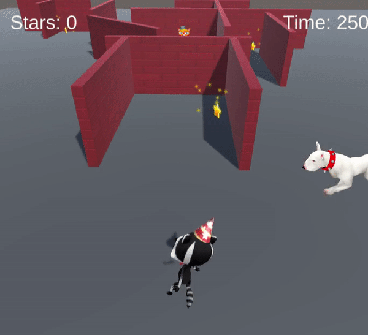

## NPC die patrouilleren

Patrouillerende NPC's kunnen worden gebruikt om spelers te vertragen. Het veranderen van hun pad, grootte, positie en snelheid kan de moeilijkheid van het spel veranderen. 

{:width="300px"}

--- task ---

Open de map **Models** in het projectvenster en voeg een **Dog** toe aan je scene.

Gebruik de Transform en Rotation tools of de Transform component om de hond in een goede positie te plaatsen om te patrouilleren — en om de speler te hinderen bij het bereiken van een ster! Plaats de hond op de **start** van zijn patrouille.

**Tip:** Om jouw kaart van bovenaf te bekijken, klik je met de rechtermuisknop waar **Persp** staat in de rechterbovenhoek van de Scene view en kies je**Top**. Om terug te keren naar de normale weergave, klik met de rechtermuisknop op **Top** en kies **Free**.

--- /task ---

--- task ---

Selecteer de Dog en ga naar het Inspector venster en **Add Component**. Kies de **Character Controller**. Plaats en bepaal de grootte van de controller.

**Tip:** Selecteer het Dog GameObject in het Hierarchy venster en druk op <kbd>Shift</kbd>+<kbd>F</kbd> om te focussen op de Dog in de Scene view.

--- /task ---

--- task ---

Klik op **Add Component ** en voeg een **Box Collider ** toe aan de **Dog** zodat de speler niet door de hond kan lopen of er bovenop kan klimmen. Wijzig het y Center (midden) en de Size (grootte):

--- /task ---

--- task ---

Omdat zowel de hond als de speler beweegt, moet je een Box Collider toevoegen aan de **Player**, zodat de hond niet boven op de speler kan klimmen.

Selecteer het **Player GameObject** in het Hierarchy venster, klik vervolgens op **Add Component** en voeg een **Box Collider** toe.  Wijzig het y Center (midden) en de Size (grootte):

--- /task ---

--- task ---

Voeg, met het Dog GameObject geselecteerd, een nieuwe script component toe en noem deze `PatrolController`.

--- /task ---

--- task ---

Open het script **PatrolController** en maak een openbare variabele `patrolSpeed` aan. Maak een andere openbare variabele voor de maximale afstand die je de hond wilt laten afleggen - noem deze `maxMovement`. Je hebt ook een laatste variabele nodig om de startpositie op te slaan, dit is een `Vector3` genaamd `startPosition`.

--- code ---
---
language: cs filename: PatrolController.cs line_numbers: true line_number_start: 5
line_highlights: 7-9
---
public class PatrolController : MonoBehaviour
{ public float patrolSpeed = 3.0f; public float maxMovement = 4.0f; public Vector3 startPosition; --- /code ---

--- /task ---

--- task ---

Voeg code toe aan de methoden `Start()` en `Update()` zodat de hond vooruit beweegt totdat de afstand vanaf zijn startpositie **groter is dan** `maxMovement`.

Eerst wordt de `Start()` methode gebruikt om de `startPosition` in te stellen wanneer het spel start.

`Vector3.Distance()` gebruikt de huidige positievector en de `startPosition` om de afstand te berekenen die de hond heeft afgelegd.

Wanneer de maximale afstand is bereikt, draait de hond `180` graden en wordt de `startPosition` variabele bijgewerkt naar de huidige positie. De hond gaat dan weer vooruit totdat de maximale afstand is bereikt, dit proces herhaalt zich om het patrouillegedrag te creëren.

--- code ---
---
language: cs filename: DogController.cs line_numbers: true line_number_start: 12
line_highlights: 14, 20, 21, 22, 23, 24, 25, 26, 27, 28, 29, 30
---

    void Start()
    {
        startPosition = transform.position;
    }
    
    // Update is called once per frame
    void Update()
    {
        CharacterController controller = GetComponent<CharacterController>();
        Vector3 forward = transform.TransformDirection(Vector3.forward);
        controller.SimpleMove(forward * patrolSpeed);
    
        float distance = Vector3.Distance(transform.position, startPosition);
    
        if (distance > maxMovement)
        {
            transform.Rotate(0, 180, 0);
            startPosition = transform.position;
        }
    }
--- /code ---

Sla je script op en ga terug naar de Unity Editor.

--- /task ---

--- task ---

**Test:** Speel je spel en controleer of de hond het moeilijker maakt om snel een ster te bereiken.

Volg de beweging van de hond. Als de lengte van de patrouille niet geschikt is voor jouw scène, kun je tijdens het spelen van het spel de Max Movement in de Inspector aanpassen.

**Tip:** Onthoud dat variabelen die in de afspeelmodus zijn bewerkt, niet worden opgeslagen na het verlaten van de afspeelmodus, dus noteer de bewegingslengte die je het beste bevalt, verlaat de afspeelmodus en stel de variabele in in de Inspector.

--- /task ---

Nu de positie en het pad van de patrouillehond is bepaald, is het tijd om de dingen realistischer te maken met animatie.

--- task ---

Navigeer in het venster Project naar de map **Animation** en vervolgens naar de map **Animator**. Klik met de rechtermuisknop en ga naar **Create** en selecteer vervolgens **Animation Controller** en noem je nieuwe animatiecontroller `PatrolRun`.

--- /task ---

--- task ---

Dubbelklik op de **PatrolRun** animatiecontroller om deze te openen in het Animator-venster.

De patrouillehond heeft slechts één animatie die steeds wordt uitgevoerd. Sleep vanuit de map Animation in het Project venster de animatie **Dog_Run** naar het Animator-venster.

**Tip:** als je niet alle vakken in het venster Animator kunt zien, kun je op het zwarte raster klikken en vervolgens op de <kbd>a </kbd> toets drukken om het venster opnieuw te laten scherpstellen. Beweeg vervolgens naar links en rechts met <kbd>Alt</kbd>+linkermuisknop of zoom in en uit met <kbd>Alt</kbd>+rechtermuisknop.

--- /task ---

--- task ---

Selecteer in het Hierarchy venster het **Dog GameObject**en ga vervolgens naar het onderdeel **Animator** in het Inspector venster. Klik op de cirkel naast Controller en selecteer **PatrolRun** om je animatiecontroller te koppelen.

--- /task ---

--- task ---

**Test:** Speel je spel om de patrouillehond over het patrouillepad te zien rennen.

--- /task ---

--- task ---

**Test:** Pas je patrouillehond aan totdat je tevreden bent met het pad en de animatie. Om het moeilijkheidsniveau te veranderen, kun je de Scale aanpassen om een grotere of kleinere hond te maken.

**Debuggen:** Als je animatie niet werkt, controleer dan in de Inspector of **Apply Root Motion** niet is geselecteerd voor je niet-spelerpersonage.

Sluit de afspeelmodus af.

--- /task ---

--- save ---
