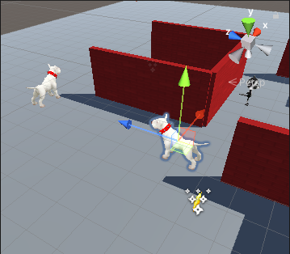
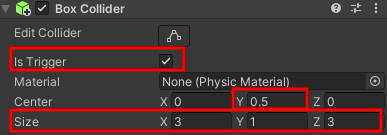
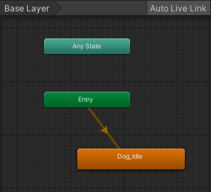
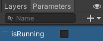

## Volger NPC

Een NPC die de speler volgt kan een obstakel zijn - en erg vervelend! 

{:width="300px"}

--- task ---

Sleep een andere hond naar de Scene view en naar een positie waar het moeilijk rond navigeren is.

--- /task ---

--- task ---

Selecteer de hond en ga naar het venster Inspector en **Add Component**. Kies de **Character Controller**. Bepaal de plaats en grootte van de controller zodat deze je hele hond bedekt.

--- /task ---

--- task ---

Klik op **Add Component** en voeg een **Box Collider** toe aan de hond zodat de speler niet door de hond kan lopen of erop kan klimmen. Wijzig het y Center (midden) en Size (grootte):

--- /task ---

--- task ---

Ga opnieuw naar de knop **Add Component** en voeg een tweede **Box Collide** toe aan de hond.

Deze Box Collider gebruikt `IsTrigger` om de hond de speler te laten volgen als de speler dichtbij genoeg komt om de aandacht van de hond te trekken. Deze Box Collider moet groot genoeg zijn zodat de speler er niet gemakkelijk langs kan sluipen:

--- /task ---

--- task ---

Voeg, met het nieuwe Dog GameObject geselecteerd, een nieuwe scriptcomponent toe en noem deze `FollowController`.

--- /task ---

--- task ---

Dubbelklik op het script **FollowController** en maak een public GameObject-variabele. Voeg code toe zodat het script toegang heeft tot de Player-attributen:

--- code ---
---
language: cs
filename: FollowController.cs
line_numbers: true
line_number_start: 5
line_highlights: 7
---
public class FollowController : MonoBehaviour

{ public GameObject Player;

--- /code ---

--- /task ---

--- task ---

Voeg een regel toe in de Update-methode zodat de hond altijd naar de speler kijkt:

--- code ---
---
language: cs
filename: FollowController.cs - Update()
line_numbers: true
line_number_start: 16
line_highlights: 18
---

    void Update()
    {
        transform.LookAt(Player.transform);
    }
--- /code ---

Sla je script op en ga terug naar de Unity Editor.

--- /task ---

--- task ---

Klik op je tweede hond in de Hierarchy en scroll naar beneden in de Inspector om het **FollowController** script in het venster te zien.

Klik op de cirkel naast Player en selecteer het **Player GameObject** in het menu:

--- /task ---

--- task ---

**Test:** Speel je minigame. Zorg ervoor dat je niet door de hond kunt lopen. Controleer of de hond continu draait om naar de speler te kijken.

Sluit de afspeelmodus af.

--- /task ---

--- task ---

Open het **FollowController** script en maak een `IsFollowing` variabele ingesteld op `false`.

--- code ---
---
language: csharp
filename: FollowController.cs
line_numbers: true
line_number_start: 5
line_highlights: 8
---
public class FollowController : MonoBehaviour
{
    public GameObject Player;
    public bool isFollowing = false;
--- /code ---

Voeg een methode toe die wordt geactiveerd wanneer de speler in botsing komt met de hond. Deze methode stelt `IsFollowing` in op `true`:

--- code ---
---
language: csharp
filename: FollowController.cs - OnTriggerEnter(Collider other)
line_numbers: true
line_number_start: 5
line_highlights: 10-16
---
public class FollowController : MonoBehaviour
{
    public GameObject Player;
    public bool isFollowing = false;

    void OnTriggerEnter(Collider other)
    {
        if (other.CompareTag("Speler"))
        {
            isFollowing = true;
        }
    }
--- /code ---

--- /task ---

--- task ---

Maak drie nieuwe variabelen om de werking van de volgactie in te stellen:

--- code ---
---
language: csharp
filename: FollowController.cs
line_numbers: true
line_number_start: 5
line_highlights: 9-11
---
public class FollowController : MonoBehaviour
{
    public GameObject Player;
    public bool isFollowing = false;
    public float followSpeed = 3f;
    public float followDistance = 2f;
    Vector3 moveDirection = Vector3.zero; // Geen beweging
--- /code ---

--- /task ---

--- task ---

Voeg code toe aan de `Update` methode om de hond naar de speler te verplaatsen met `SimpleMove`.

Door de positievector van de Volger af te trekken van de positievector van de Speler met `Player.transform.position - transform.position` krijg je de richting en afstand tussen deze twee personages. De methode `Vector3.Normalize` verandert dit in een enkele eenheidsvector, die kan worden gebruikt met `SimpleMove`.

De hond mag zich alleen op een afstand van de speler verplaatsen, zodat de hond niet probeert om naar dezelfde ruimte als de speler te gaan.

--- code ---
---
language: csharp
filename: FollowController.cs - Update()
line_numbers: true
line_number_start: 27
line_highlights: 30-39
---

    void Update()
    {
        transform.LookAt(Player.transform);
        if (isFollowing == true)
        {
            if (Vector3.Distance(Player.transform.position, transform.position) > followDistance)
            {
                CharacterController controller = GetComponent<CharacterController>();
                var moveDirection = Vector3.Normalize(Player.transform.position - transform.position);
                controller.SimpleMove(moveDirection * followSpeed);
            }
        }
    }
--- /code ---

Sla je script op en ga terug naar de Unity Editor.

--- /task ---

--- task ---
**Test:** Speel je scène af en loop naar de hond toe zodat je dichtbij genoeg bent om de gebeurtenis te activeren, en loop dan weg. Controleer of de hond je volgt.

Sluit de afspeelmodus af.

--- /task ---

Animation Controllers kunnen meer dan één animatie hebben. De volg hond heeft animaties nodig zowel voor wanneer hij niet actief als wanneer hij beweegt.

--- task ---

Selecteer in het projectvenster de map **Animators** in **Animation**. Klik met de rechtermuisknop en maak vervolgens een nieuwe **Animation Controller** met de naam `FollowerMove`.

Klik op de **Dog** en ga naar het Inspector-venster. Sleep de controller **FollowerMove** naar de eigenschap **Controller** in de component Animator:

--- /task ---

--- task ---

Dubbelklik op de controller **FollowerMove** om deze te openen in het animatievenster. Sleep de animatie **Dog_Idle** naar het raster en plaats deze in de buurt van het groene vak 'Entry':

--- /task ---

--- task ---

**Test:** Speel je minigame en controleer of de hond beweegt als hij inactief is.

Sluit de afspeelmodus af.

--- /task ---

De hond heeft een andere animatie nodig wanneer hij beweegt.

--- task ---

Sleep de **Dog_Run** animatie naar het Animator-venster voor de **FollowerMove** controller.

Klik met de rechtermuisknop op **Dog_Idle** en selecteer **Make Transition** en verbind de transitie met **Dog_Run**. Klik met de rechtermuisknop op **Dog_Run** en selecteer **Make Transition** en verbind de overgang met **Dog_Idle** zodat je overgangen in beide richtingen hebt.

--- /task ---

--- task ---

Ga naar het tabblad **Parameters** en klik op de vervolgkeuzepijl naast de '+'. Kies **bool** en noem je nieuwe variabele `isRunning`.

--- /task ---

--- task ---

Ga naar het Animator-venster en klik op de overgangspijl van Dog_Idle naar Dog_Run:

Ga in het Inspector venster voor die overgang naar de component Conditions en klik op de **+**. De voorwaarde moet zijn `isRunning` is `true`:

Schakel het selectievakje 'Has Exit Time' uit zodat de animatie meteen overschakelt:

--- /task ---

--- task ---

Selecteer de overgangspijl van Dog_Run naar Dog_Idle en volg dezelfde stappen. Schakel het selectievakje 'Has Exit Time' uit, maar voeg deze keer de voorwaarde `isRunning` is `false` toe:

--- /task ---

--- task ---

Open het **FollowController** script en maak een **Animator-variable** aan. Voeg code toe aan de `Start` -methode om `isRunning` op `false` in te stellen:

--- code ---
---
language: csharp
filename: FollowerController.cs - Start()
line_numbers: true
line_number_start: 21
line_highlights: 21, 25-26
---

    Animator anim;
    // Start wordt aangeroepen vóór de eerste frame-update
    void Start()
    {
        anim = gameObject.GetComponent<Animator>();
        anim.SetBool("isRunning", false);
    }
--- /code ---

--- /task ---

--- task ---

Werk de `if (isFollowing)` code bij om de animatie te besturen:

--- code ---
---
language: csharp
filename: FollowerController.cs - Update()
line_numbers: true
line_number_start: 30
line_highlights: 37, 42-45
---

    void Update()
    {
        transform.LookAt(Player.transform);
        if (isFollowing == true)
        {
            if (Vector3.Distance(Player.transform.position, transform.position) > followDistance)
            {
                anim.SetBool("isRunning", true);
                CharacterController controller = GetComponent<CharacterController>();
                var moveDirection = Vector3.Normalize(Player.transform.position - transform.position);
                controller.SimpleMove(moveDirection * followSpeed);
            }
            else
            {
                anim.SetBool("isRunning", false);
            }
        }
    }
--- /code ---

Sla je script op en ga terug naar de Unity Editor.

--- /task ---

--- task ---

**Test:** Speel je minigame en kijk wat er gebeurt in de animator als je in botsing komt met en wegrent van de hond.

**Tip:** Om het animatie-effect beter te zien tijdens het testen in de afspeelmodus:
+ Klik op de hond in het Hierarchy venster en ga vervolgens naar het Follow Controller script in het Inspector venster. Vertraag de volgsnelheid van de hond naar `0.1`.
+ Klik op de speler in het Hierarchy venster en ga vervolgens naar Main Camera child GameObject. Verander in het Inspector venster de z-positie van de camera naar `-10`.

**Tip:** Zorg ervoor dat er geen punten in je spel zijn waar de volghond de speler volledig in de val kan lokken.

Sluit de afspeelmodus af.

--- /task ---

--- save ---
