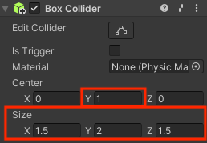
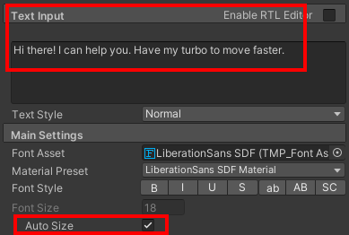

## NPC bondgenoten

Bondgenoten (Allies) zijn personages die de speler helpen door ze aanwijzingen of voorwerpen te geven; of door ze vaardigheden te geven zoals turbosnelheid.

{:width="300px"}

Tot nu toe heeft de minigame meerdere vijanden, maar geen bondgenoten. Het zou geweldig zijn om een bondgenoot te hebben die de speler een turbolading geeft om de speler sneller te laten bewegen en te draaien om het spel sneller te voltooien.

--- task ---

Sleep een Rat naar de Scene view en naar een positie die de speler niet kan zien wanneer het spel begint:

--- /task ---

--- task ---

Selecteer de Rat, ga naar het Inspector venster en **Add Component**. Kies de **Character Controller**. Plaats en bepaal de grootte van de controller zodat deze het midden van de Rat bedekt:

--- /task ---

--- task ---

Klik op **Add Component** en voeg een **Box Collider** toe aan de Rat zodat de speler niet door de Rat kan lopen of erop kan klimmen. Wijzig het y- Center (midden) en Size (grootte):

--- /task ---

Met animatie komt een NPC tot leven.

--- task ---

Navigeer in het projectvenster naar de map **Animation**. Klik met de rechtermuisknop en ga naar **Create** en selecteer vervolgens **Animation Controller** en geef je nieuwe animatiecontroller de naam `AllyIdle`.

Dubbelklik op de **AllyIdle** animatiecontroller om deze te openen in het Animator-venster.

Sleep vanuit de map Animation in het projectvenster de **Cat_IdleHappy** animatie naar het Animator-venster:

**Tip:** Je kunt de Cat animations op de rat en wasbeer gebruiken omdat ze zijn ontworpen als mensachtigen (rechtop staand, twee armen en twee benen).

--- /task ---

--- task ---

Selecteer in het Hierarchy venster de **Rat**en ga vervolgens naar de **Animator** component in het Inspector venster. Klik op de cirkel naast Controller en selecteer **AllyIdle** om je Animation Controller te koppelen:

**Tip:** je kunt ook de Animation Controller van het venster Projecten naar de Controller eigenschap van de Animator in de Inspector slepen.

--- /task ---

--- task ---

Je kunt dezelfde Animator Controller gebruiken voor de gamemaster om ze tot leven te brengen!

Selecteer je Gamemaster in het Hierarchy venster en sleep de **AllyIdle** controller naar het veld Controller.

--- /task ---

--- task ---

**Tip:** Speel je spel om de animatie op de Rat te zien:

Sluit de afspeelmodus af.

--- /task ---

Een personage met het Shield-model als een child GameObject zal eruit zien alsof ze een speciaal effect of kracht hebben. In je minigame vertegenwoordigt het schild een powerup met turbosnelheid.

Als de speler het schild heeft, zullen ze twee keer zo snel bewegen en draaien - maar als de bondgenoot verborgen is, zullen ze erin slagen het schild vroeg genoeg te vinden om een verschil te maken?!

--- task ---

Ga in het projectvenster naar de map **Models** en zoek het **Shield**. Sleep het schild omhoog naar het Hierarchy venster en plaats het als een onderliggend GameObject van de speler:

Hierdoor wordt het schild automatisch in dezelfde positie geplaatst als de speler:

{:width="300px"}

Je gebruikt code om het schild te verbergen totdat de speler de turbo power boost van de Ally NPC oppakt.

--- /task ---

--- task ---

Voeg ook een schild toe als een child GameObject van de Rat:

Hiermee wordt het schild automatisch toegevoegd in dezelfde positie als de Rat:

{:width="300px"}

--- /task ---

--- task ---

Klik met de rechtermuisknop op de **Rat** in het Hierarchy venster en selecteer vanuit de UI **Text - TextMeshPro**:

Voeg in het Inspector-venster voor het nieuwe Text (TMP) GameObject **Text Input** toe en vink het vakje **Auto Size** aan:

--- /task ---

--- task ---

Gebruik de Rect Transform-component in het Inspector venster om de tekst linksonder te verankeren en wijzig vervolgens de Pos x- en Pos y-coördinaten:

**Tip:** Klik op het tabblad **Game** om te zien hoe de tekst eruitziet in de spelweergave.

--- /task ---

Het schild is zichtbaar bij de Rat totdat de speler er tegenaan botst. Het schild wordt dan overgedragen aan de speler en de rat zal verdwijnen.

--- task ---

Ga opnieuw naar de knop **Add Component** en voeg een tweede **Box Collider** toe aan de Rat.

Vink `IsTrigger` aan en wijzig de grootte zodat deze groter is dan de eerste Box-collider:

--- /task ---

--- task ---
Voeg met het Ally Rat GameObject geslecteerd een nieuwe scriptcomponent toe en geef deze de naam `AllyController`.

Dubbelklik op het **AllyController** script om het te openen in je scripteditor. Voeg code toe om de TMPro namespace te gebruiken:

--- code ---
---
language: csharp
filename: AllyController.cs
line_numbers: true
line_number_start: 1
line_highlights: 4
---
using System.Collections;
using System.Collections.Generic;
using UnityEngine;
using TMPro;
--- /code ---

--- /task ---

--- task ---

Maak public GameObject- en Canvas-variabelen en voeg code toe om de turbosnelheidsboost op de Ally te activeren en niet op de speler, en schakel het canvas aan het begin uit:

--- code ---
---
language: csharp
filename: AllyController.cs 
line_numbers: true
line_number_start: 6
line_highlights: 8, 9, 10, 11, 16, 17,18
---
public class AllyController : MonoBehaviour
{
    public GameObject turbo; // Turbo schild op NPC
    public GameObject playerTurbo; // Turbo Shield op speler
    public PlayerController player;
    public GameObject canvas;

    // Start wordt aangeroepen voor de eerste frame-update 
    void Start() 
    {
        turbo.SetActive(true);
        playerTurbo.SetActive(false);
        canvas.SetActive(false);
     }
--- /code ---

--- /task ---

--- task ---

Voeg code toe om het canvas in te schakelen en de turbo van de bondgenoot naar de speler te wisselen en de speler de turboversnelling te geven:

--- code ---
---
language: csharp
filename: AllyController.cs - OnTriggerEnter(Collider other)
line_numbers: true
line_number_start: 6
line_highlights: 13-23
---
public class AllyController : MonoBehaviour
{
    public GameObject turbo; // Turbo schild op NPC
    public GameObject playerTurbo; // Turbo Shield op speler
    public PlayerController player;
    public GameObject canvas;

    void OnTriggerEnter(Collider other)
    {
        if (other.CompareTag("Speler"))
        {
            turbo.SetActive(false);
            playerTurbo.SetActive(true);
            player.moveSpeed *= 2;
            player.rotateSpeed *= 2;
            canvas.SetActive(true);
        }
    }
--- /code ---

--- /task ---

--- task ---

Voeg een `OnTriggerExit` -methode toe om de rat te verwijderen zodra de speler weggaat om door te gaan met het spel:

--- code ---
---
language: csharp
filename: AllyController - OnTriggerExit(Collider other)
line_numbers: true
line_number_start: 25 
line_highlights: 25-31
---

    void OnTriggerExit(Collider other)
    {
        if (other.CompareTag("Speler"))
        {
            gameObject.SetActive(false);
        }
    }
    
    // Start wordt aangeroepen vóór de eerste frame-update
    void Start()
    {
--- /code ---

Sla je script op en ga terug naar de Unity Editor.

--- /task ---

--- task ---

Klik op de **Rat** in het Hierarchy venster en zoek het **AllyController** script in het Inspector-venster.

De component zou nu vier nieuwe eigenschappen moeten hebben.

**Debuggen:** De eigenschappen verschijnen niet als je script fouten bevat. Controleer de Console en los eventuele fouten op.

--- /task ---

--- task ---

Sleep vanuit het Hierarchy venster:
+ Het Shield als onderliggend GameObject van de Rat naar de Turbo-eigenschap
+ Het Shield als onderliggend GameObject van de speler naar de speler Turbo-eigenschap
+ Het Player GameObject naar de eigenschap Player
+ Het Canvas onderliggend GameObject van de Rat naar de Canvas-eigenschap

--- /task ---

--- task ---

**Test:** Voer je minigame uit en zorg ervoor dat de speler versnelt wanneer de turbo is toegepast.

Experimenteer met de waarden van Move Speed en Rotate Speed in de afspeelmodus tot je het gewenste turbo-effect hebt. Onthoud dat eventuele wijzigingen die je hier aanbrengt niet worden opgeslagen wanneer je de afspeelmodus verlaat, dus noteer de waarden en bewerk ze daarna in het script.

**Tip:** Als je het verschil in snelheid niet kunt zien in de Game-weergave, kun je de variabelen voor de Player bekijken in de Inspector-weergave. Ze veranderen van 3 naar 6 wanneer de turbo is overgezet naar de speler:

**Tip:** Als het schild op het verkeerde personage verschijnt, controleer dan of de eigenschap `turbo` het schild van de rat heeft en `playerTurbo` het schild van de speler.

Sluit de afspeelmodus af.
--- /task ---

--- save ---
