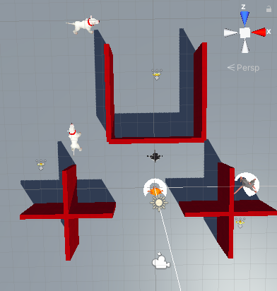

## You will make

Create 3D non-player characters to interact with, avoid, and collect from.

This project is brought to you with generous support from [Unity Technologies](https://unity.com/){:target="_blank"}.  These [projects](https://projects.raspberrypi.org/en/pathways/unity-intro){:target="_blank"} offer young people the opportunity to take their first steps in creating virtual worlds using Real-Time 3D.

This project follows on from [Star collector](https://projects.raspberrypi.org/en/projects/star-collector){:target='_blank'}. You can use the Unity scene that you created in that project as the basis for this project. We’ve also provided a starter project that you can use.

A **non-player character (NPC)** is a character that is not controlled by the person playing the game. NPCs can be set up for the player to interact with, avoid, compete with, or are simply used to populate the game world.

You will:
+ Add non-player characters (NPCs) with animation and movement
+ Interact with NPCs using simple dialog and buttons
+ Use child GameObjects to allow players to hold other GameObjects

--- no-print ---

### Play ▶️

--- task ---

Click on the embedded project. Interact with the NPCs:
+ How does the cat control the game?
+ What changes are made when you interact with the rat?
+ Which movement patterns do the dogs have? How do they differ?

<iframe allowtransparency="true" width="710" height="450" src="https://raspberrypilearning.github.io/unity-webgl/npc-basic" frameborder="0"></iframe> --- /task --- --- /no-print ---

--- print-only ---  --- /print-only ---
